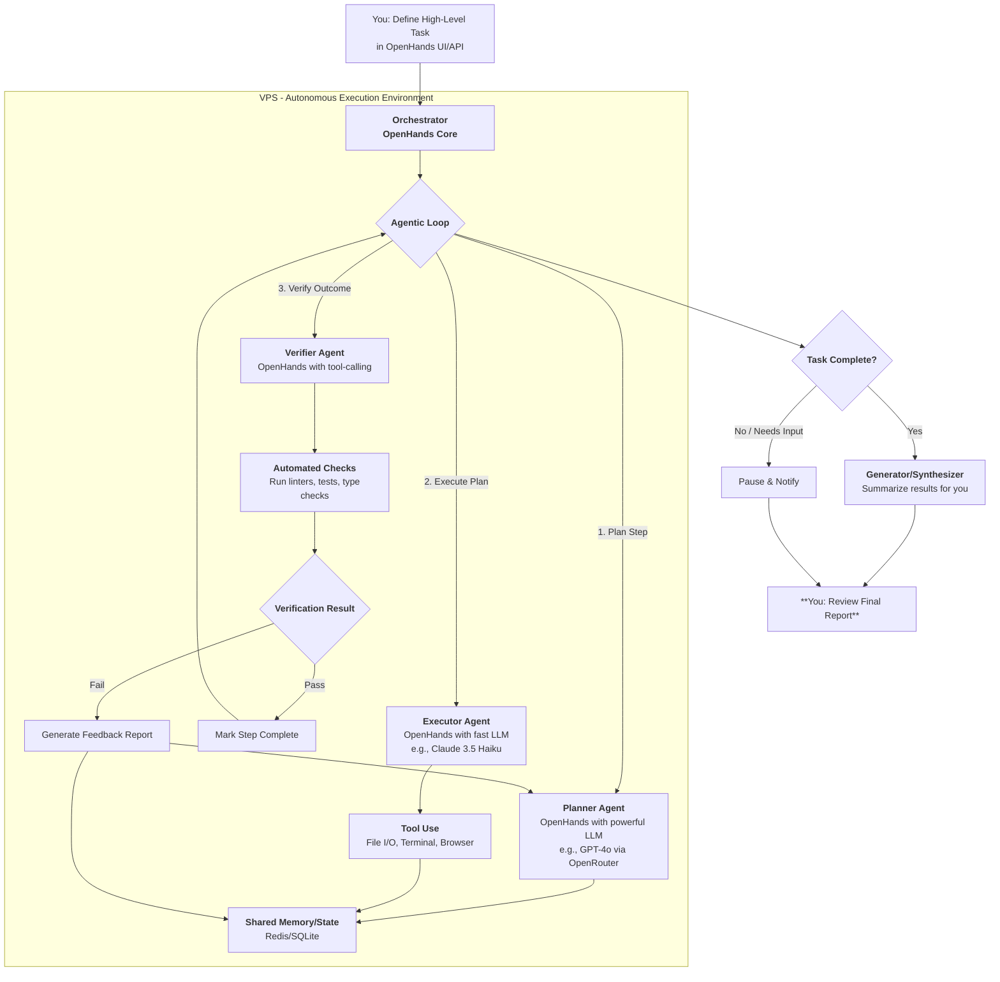

### **Technical Report: Architecting an Autonomous Agentic Workflow from the AgentFlow Blueprint**

**Date:** February 21, 2026
**Subject:** Analysis of AgentFlow and a Practical Implementation Plan for Autonomous Overnight Execution

### **1. Executive Summary**

This report analyzes the AgentFlow framework to extract its core innovations for creating reliable, autonomous agentic workflows. The primary value of AgentFlow lies not in its code, but in its **modular, multi-agent architecture with an integrated optimization algorithm (Flow-GRPO)** . This design systematically separates planning, execution, verification, and synthesis, directly addressing your need to reduce active supervision.

This report proposes a practical, budget-conscious architecture that replicates this modular philosophy using existing, accessible tools. The core strategy is to replace your current linear "watch-and-guide" loop with a robust, asynchronous "plan-delegate-verify" pipeline. This involves creating a persistent **orchestrator** that manages a **planner agent** (for high-level task breakdown), **executor agents** (your existing Cursor/CLI tools), and a **verification agent** (to check work autonomously). By implementing this system on a Virtual Private Server (VPS) with robust error handling and asynchronous communication, you can confidently delegate overnight tasks and return to review completed, verified work, freeing you to focus on higher-level engineering.

### **2. Analysis of AgentFlow's Core Value for Your Use Case**

AgentFlow's key innovation is its shift from a single, monolithic agent to a **system of specialized, trainable agents**. For your goal of autonomous execution, the most valuable components are not the specific code, but its underlying architectural principles:

| AgentFlow Component | Core Function | Value for Autonomous Workflow |
| :--- | :--- | :--- |
| **Modular Decomposition (Planner, Executor, Verifier, Generator)** | Separates concerns into distinct stages: planning, doing, checking, and summarizing. | **Directly enables your "plan and review" goal.** You can supervise the plan and review the final summary, while the system autonomously handles the loop of execution and verification. The Verifier module is critical for reducing interventions. |
| **In-the-Flow Optimization (Flow-GRPO)** | Trains the Planner agent on-policy, learning from the success/failure of the entire multi-turn process. | This is what makes a modular system **reliable**. It allows the Planner to learn from past mistakes (e.g., "last time I planned a broad refactor, the Executor broke three files"). This long-term learning is key to reducing the need for your oversight. |
| **Evolving Shared Memory** | Maintains context, action history, and tool outputs across multiple turns. | Prevents the agent from getting lost in a long task. It provides the necessary context for the Verifier to check progress and for the Planner to adapt its strategy based on previous steps. |
| **Dynamic Tool Integration** | Allows the system to load and use diverse tools (code executors, search, etc.) as needed. | For your use case, this means the system can seamlessly call your coding tools, run tests, check documentation, or even perform web searches for APIs, all within a single, autonomous workflow. |

The arXiv paper ([https://arxiv.org/pdf/2510.05592](https://arxiv.org/pdf/2510.05592)) confirms the efficacy of this approach, showing that such a system, even with a smaller 7B-parameter model, can outperform monolithic systems and larger models by improving planning and tool-calling reliability. For you, this translates to: **a well-architected system is more reliable than a more powerful but poorly structured agent.**

### **3. Proposed Architecture: A Practical, Budget-Conscious Implementation**

Directly deploying AgentFlow might be complex. Instead, we can build a system that embodies its principles using a stack of accessible, open-source, and existing tools, fitting comfortably within your $60/month budget (plus VPS).

**Core Philosophy:** Replace your manual monitoring with an **automated verification loop**.

#### **3.1. Technology Stack**

*   **Core Orchestrator & Agents:** **OpenHands** (formerly OpenDevin). This is a mature, open-source platform for autonomous AI software engineers. It has a built-in agent architecture that can be customized.
*   **LLM Backend:** **OpenRouter**. This service provides a unified API to dozens of models (OpenAI, Anthropic, Google, open-source models). It allows you to dynamically choose the best model for each task (e.g., a powerful planner vs. a fast, cheap executor) and fits your budget.
*   **Execution Environment:** Your **VPS** (e.g., a $30/month Hetzner or DigitalOcean droplet). This will host the orchestrator and provide a persistent, powerful environment for long-running tasks.
*   **Verification Tooling:** **pytest**, **eslint**, **mypy**, **Prettier**. These are the ground-truth verifiers for code quality and functionality. The agent must be instructed to use them.
*   **State Management & Communication:** **Redis** or a simple **SQLite database** on the VPS. This will store task states, plans, and results, allowing for asynchronous operation (you can disconnect, and the system continues).

#### **3.2. Architectural Diagram & Workflow**

This architecture directly mirrors AgentFlow's modules using concrete tools.

**Workflow Description:**
1.  **Delegation:** You define the task in the OpenHands interface, set it running on the VPS, and disconnect.
2.  **Planning:** The Orchestrator's Planner agent breaks the high-level task into a granular, step-by-step plan, storing it in shared memory.
3.  **Execution Loop:** For each step, the Executor agent performs the action (e.g., "edit file x", "run command y").
4.  **Verification:** The Verifier agent then runs predefined checks (linters, tests) on the changes.
5.  **Feedback Loop:**
    *   If verification **passes**, the step is marked complete, and the loop moves to the next step.
    *   If verification **fails**, the errors are captured, fed back into memory, and the Planner is triggered to revise the plan for that step. The system iterates autonomously until the step passes or a retry limit is reached.
6.  **Synthesis & Review:** Upon completion or encountering an unrecoverable error, the system generates a summary report of actions taken, successes, and failures for your morning review.

### **4. Implementation Strategy for Autonomous Overnight Execution**

To achieve your goal of minimal supervision, focus on building the **Verifier** and **Feedback Loop**.

1.  **Phase 1: Foundation - Setup OpenHands on VPS.**
    * Deploy a VPS with Docker. Run OpenHands using their official Docker image. Configure it to use OpenRouter as the LLM provider. Test basic file editing and command execution.

2.  **Phase 2: Define the "Verifier" Role.**
    * This is the most critical step. Create a custom instruction set or a simple script for the agent. The core instruction is: **"After every code modification, you MUST run the relevant verification commands. Do not proceed until they pass."**
    *   **Example Prompt Snippet for the Agent:** `"Your workflow is: 1. Understand the task. 2. Propose a file change. 3. Implement the change. 4. **Run [linter command, e.g., `npm run lint`] and [test command, e.g., `pytest`].** 5. If errors occur, analyze them and go back to step 2. 6. Only when all checks pass, report success."`

3.  **Phase 3: Implement Asynchronous Operation.**
    * OpenHands can run in a headless mode. You can start a task via its API, detach, and later poll for status/results. Store the final output in a file or database on the VPS for your morning review.

4.  **Phase 4: Iterative Refinement with "Agentic Memory".**
    * As the system runs tasks, its logs (successes, failures, error messages) become a valuable dataset. You can use this to refine your instructions. For a more advanced setup, you could fine-tune a small model (like a quantized Llama 3) on these logs to act as a more reliable planner for your specific project patterns, mimicking the effect of AgentFlow's Flow-GRPO.

### **5. Improving Agent Reliability: From Intervention to Review**

Your investment shifts from active watching to proactive engineering of the agent's environment.

*   **Invest in "Context Engineering":** Instead of monitoring the run, spend your time crafting more precise `agents.md` documentation. Include explicit verification steps for common tasks (e.g., "When adding a new function, always add a corresponding unit test and update the type stub.").
*   **Build a "Tool Library":** Create custom bash scripts or Python tools that the agent can call to perform complex, multi-step, or risky operations safely. For example, a `safe_refactor` script that checks out a new branch, runs linters, and reports a diff before committing. This encapsulates risk and makes the agent's actions more predictable.
*   **Establish a "Human-in-the-Loop" Gate for Critical Actions:** For irreversible actions (e.g., `git push to main`, `database migration`), program the system to pause and notify you, waiting for explicit approval. This provides a safety net without requiring you to watch every minor step.
*   **Analyze Failure Logs:** The most valuable data is when the system fails. Spend your review time analyzing the logs to understand *why* the verification failed. Was it a flawed plan? A missing tool? An ambiguous instruction? Use this insight to improve the system's prompts, tools, or documentation.

### **6. Conclusion**

By adopting the modular, verification-centric philosophy of AgentFlow, you can build a powerful, autonomous coding system. Using OpenHands on a VPS as your orchestrator, combined with OpenRouter for flexible LLM access, provides a practical and cost-effective path to achieving your "plan and review" workflow. The key is to shift your effort from real-time monitoring to building robust verification rules and clear documentation that empowers the agent to self-correct, freeing you to focus on the higher-level challenges of agentic engineering.

---

## Official / 2026 links

- [AgentFlow project](https://agentflow.stanford.edu/) · [arXiv HTML 2510.05592](https://arxiv.org/html/2510.05592)
- [ICLR 2026 virtual poster](https://iclr.cc/virtual/2026/poster/10009931)
- [`research_overnight_stack_web/findings_orchestration_deer_agentflow_gas.md`](research_overnight_stack_web/findings_orchestration_deer_agentflow_gas.md)
