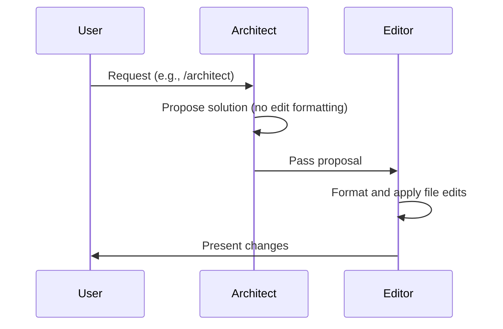

# DeepWiki Q&A with Code Context for Repository: Aider-AI/aider
## Q1
I don't understand how aider is any different than using e.g. opencode or cursor, how would this be beneficial if someone was already using those tools? (if would even be beneficial)
### Answer
Aider is a terminal-first AI pair programming tool that emphasizes deep git integration, repository-aware context via a repo map, flexible multi-model workflows (architect/editor), and open-source extensibility. If you already use tools like OpenCode or Cursor, aider can still be beneficial when you prefer terminal-driven workflows, need fine-grained control over edit formats, or want to pair reasoning models with fast editors for cost/latency trade-offs.

---

### Key differentiators from the codebase

- **Terminal-first with deep git integration**: Aider runs in your terminal and automatically commits changes with sensible messages, keeping you in control of git history aider:63-66 .
- **Repository map for context**: It builds a concise, graph-ranked map of your entire repo using tree-sitter, so the LLM sees relevant symbols without you having to add many files aider:12-20 aider:80-89 .
- **Multiple edit strategies**: Supports diff, whole, udiff, context, and architect formats, selected per model or task aider:11-14 .
- **Architect/Editor workflow**: Split reasoning (architect) from code editing (editor), allowing you to pair strong reasoning models with fast/cheap editors aider:319-333 .
- **Watch mode for IDEs**: With `--watch-files`, aider detects AI comments in your code (e.g., `// ... AI!`) and acts on them, enabling a hybrid IDE + terminal workflow aider:37-60 .
- **Copy/paste mode**: Streamlines working with web UI LLMs by auto-copying context and pasting responses back to apply edits locally aider:81-90 .
- **Multi-provider, open source**: Connects to 100+ LLMs via litellm and is Apache 2.0 licensed, avoiding vendor lock-in aider:112-119 aider:369-372 .

### Architect/Editor flow example



### When it adds value even if you use Cursor/OpenCode

- You prefer terminal-driven workflows and git-centric automation.
- You want to use a reasoning model (e.g., o1-preview) as architect with a cheaper/faster editor model.
- You need fine-grained control over edit formats or want to work across multiple LLM providers.
- You like the “watch comments” workflow to stay in your IDE while aider handles edits in the terminal.
- You value open-source tooling you can script and extend.

## Notes
I can’t directly compare OpenCode or Cursor internals since they aren’t in this codebase. The points above are derived from aider’s documented features and architecture. If you use Cursor/OpenCode for their IDE-native UX, consider using aider alongside them via watch mode or copy/paste mode rather than as a full replacement.

Wiki pages you might want to explore:
- [Overview (Aider-AI/aider)](/wiki/Aider-AI/aider#1)
### Citations
**File:** README.md (L63-66)
```markdown
### [Git integration](https://aider.chat/docs/git.html)

<a href="https://aider.chat/docs/git.html"></a>
Aider automatically commits changes with sensible commit messages. Use familiar git tools to easily diff, manage and undo AI changes.
```
**File:** README.md (L112-119)
```markdown
# DeepSeek
aider --model deepseek --api-key deepseek=<key>

# Claude 3.7 Sonnet
aider --model sonnet --api-key anthropic=<key>

# o3-mini
aider --model o3-mini --api-key openai=<key>
```
**File:** aider/website/docs/repomap.md (L12-20)
```markdown
Aider
uses a **concise map of your whole git repository**
that includes
the most important classes and functions along with their types and call signatures.
This helps aider understand the code it's editing
and how it relates to the other parts of the codebase.
The repo map also helps aider write new code
that respects and utilizes existing libraries, modules and abstractions
found elsewhere in the codebase.
```
**File:** aider/website/docs/repomap.md (L80-89)
```markdown
Aider solves this problem by sending just the **most relevant**
portions of the repo map.
It does this by analyzing the full repo map using
a graph ranking algorithm, computed on a graph
where each source file is a node and edges connect
files which have dependencies.
Aider optimizes the repo map by
selecting the most important parts of the codebase
which will
fit into the active token budget.
```
**File:** aider/website/docs/usage/modes.md (L11-14)
```markdown
- `code` - Aider will make changes to your code to satisfy your requests.
- `ask` - Aider will discuss your code and answer questions about it, but never make changes.
- `architect` - Like code mode, aider will change your files. An architect model will propose changes and an editor model will translate that proposal into specific file edits.
- `help` - Aider will answer questions about aider: usage, configuration, troubleshooting, etc.
```
**File:** aider/website/_posts/2024-09-26-architect.md (L319-333)
```markdown
The Architect/Editor approach splits this into two inference steps, possibly
using two different LLMs:

1. Solve the coding problem (Architect).
2. Turn the proposed solution into a series of well formed code edits (Editor).

The Architect/Editor approach allows the Architect to focus on solving the coding problem
and *describe the solution however comes naturally to it*.
Similarly, the Editor can focus all of its attention on properly formatting the edits
without needing to reason much about how to solve the coding problem.

We can assign the Architect and Editor roles to LLMs which are well suited to their needs.
Strong reasoning model like o1-preview make excellent Architects, while
the Editor role can be assigned to an appropriate model based on cost, speed
and code editing skill.
```
**File:** aider/website/docs/usage/watch.md (L37-60)
```markdown
If you run aider with `--watch-files`, it will watch all files in your repo
and look for any AI coding instructions you add using your favorite IDE or text editor.

Specifically, aider looks for one-liner comments (# ... or // ...) that either start or end with `AI`, `AI!` or `AI?` like these:

```python
# Make a snake game. AI!
# What is the purpose of this method AI?
```

Or in `//` comment languages...

```js
// Write a protein folding prediction engine. AI!
```

Aider will take note of all the comments that start or end with `AI`.
Comments that include `AI!` with an exclamation point or `AI?` with a question
mark are special.
They trigger aider to take action to collect *all* the AI comments and use them
as your instructions.

- `AI!` triggers aider to make changes to your code.
- `AI?` triggers aider to answer your question.
```
**File:** aider/website/docs/usage/copypaste.md (L81-90)
```markdown
Aider has a `--copy-paste` mode that streamlines this entire process:

- Whenever you `/add` or `/read` files, aider will automatically copy the entire, updated
code context to your clipboard. 
You'll see "Copied code context to clipboard" whenever this happens.
- When you copy the LLM reply to your clipboard outside aider, aider will automatically notice
and load it into the aider chat. 
Just press ENTER to send the message
and aider will apply the LLMs changes to your local files.
- Aider will automatically select the best edit format for this copy/paste functionality. 
```
**File:** aider/website/docs/faq.md (L369-372)
```markdown
Aider is 
[open source and available on GitHub](https://github.com/Aider-AI/aider)
under an 
[Apache 2.0 license](https://github.com/Aider-AI/aider/blob/main/LICENSE.txt).
```

---

## Official / 2026 links

- [Scripting aider](https://aider.chat/docs/scripting.html) · [Chat modes / architect](https://aider.chat/docs/usage/modes.html) · [Architect blog post](https://aider.chat/2024/09/26/architect.html)
- [GitHub `Aider-AI/aider`](https://github.com/Aider-AI/aider)
- [`research_overnight_stack_web/findings_complementary_aider_scenarios.md`](research_overnight_stack_web/findings_complementary_aider_scenarios.md)
