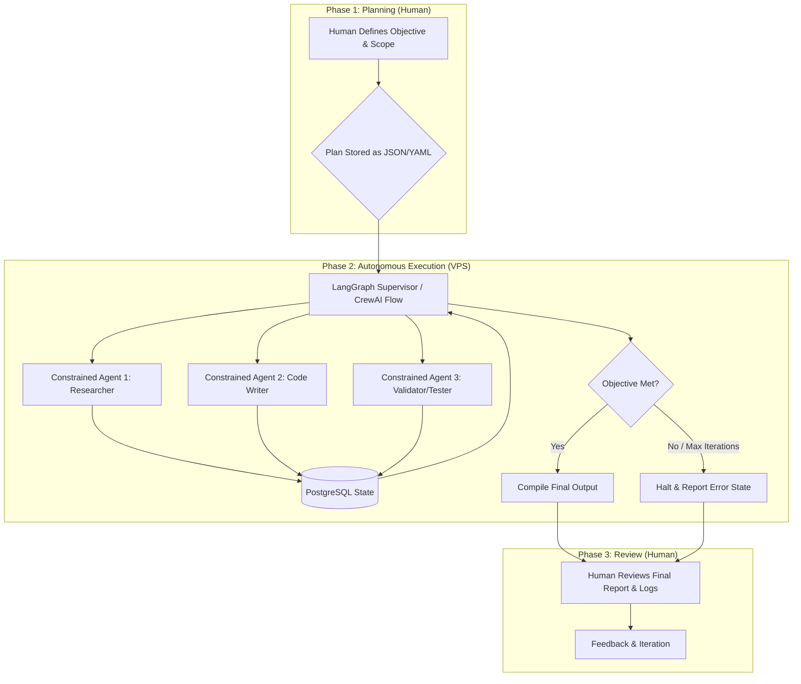

Based on your goal of shifting from active monitoring to a "plan-and-delegate" workflow, this report provides a detailed technical analysis of the CrewAI framework and a practical blueprint to achieve autonomous, overnight execution within your specified budget.

The core insight from your current pain point is that **reliability is the single biggest hurdle to agentic automation**. To move from supervision to delegation, we must design systems that are "boring" by design—prioritizing constrained scopes and deterministic outputs over complex, open-ended autonomy .

Here is the comprehensive technical report covering CrewAI's core components, alternative tools, a budget-conscious architecture, and implementation strategies for hands-off operation.

---

### **Technical Report: Achieving Autonomous Agentic Workflows**

**Date:** February 26, 2026
**To:** Engineering Lead
**Subject:** Analysis of CrewAI and a Blueprint for Autonomous, Overnight Agent Execution

### **1. Executive Summary**

This report analyzes the CrewAI framework and outlines a strategy to evolve your workflow from active, real-time supervision to a plan-and-review model. While CrewAI offers a robust structure with its **Crews (role-based collaboration)** and **Flows (event-driven orchestration)** , the key to autonomy is not the framework itself, but the engineering discipline applied around it.

To achieve unsupervised execution, you must transition from a monolithic task definition to a system built on:
1.  **Highly Constrained Agents:** Agents designed to perform fewer than 10 steps with a narrow scope .
2.  **Deterministic Handoffs:** Using CrewAI's `Flow` or a graph-based alternative to create predictable, conditional execution paths.
3.  **Externalized State & Memory:** Treating agent context as a structured database to prevent "context poisoning" .
4.  **Robust Observability:** Implementing post-execution tracing and logging to enable asynchronous review, rather than live monitoring.

This report recommends a hybrid architecture combining the **collaborative structure of CrewAI** with the **fine-grained control of LangGraph**, deployed on a **Virtual Private Server (VPS)** . This approach fits within your $60/month budget (excluding VPS/compute costs) and provides the necessary foundation for reliable, overnight runs.

### **2. Core Analysis: The CrewAI Technique**

CrewAI's value lies in its opinionated structure, which directly addresses the challenges of multi-agent collaboration. Its core components are:

- **Role-Based Agents:** This is CrewAI's fundamental building block. By assigning a `role`, `goal`, and `backstory`, you create specialized workers (e.g., "Senior Research Analyst," "Code Quality Guardian"). This decomposition of responsibility makes complex tasks manageable and mimics human team dynamics .
- **Task-Centric Workflow:** Work is broken into discrete `Task` objects, each assigned to a specific agent. Tasks define a `description`, an `expected_output`, and crucially, dependencies (`depends_on`). This forces you to explicitly define the workflow graph .
- **Crews and Flows:**
    - **Crews** manage the collaborative intelligence of agents. They handle delegation and communication, allowing agents to work together on a shared goal, such as in a sequential or hierarchical process .
    - **Flows** are the key to production-grade automation. They provide an event-driven, programmable layer to orchestrate not just agents, but any Python function. This allows for conditional logic, loops, and state management *between* tasks, moving beyond simple linear execution .
- **Declarative YAML Configuration:** The ability to define agents and tasks in `agents.yaml` and `tasks.yaml` separates the "what" from the "how." This is a powerful technique for iterating on prompts and workflows without modifying core Python code .

**Why CrewAI is Valuable for Your Goal:** Its structure directly combats the "reliability gap." By forcing you to define roles, outputs, and dependencies, it encourages the creation of "simple and short" agent steps. However, its true power for autonomous execution is the **Flows** feature, which allows you to programmatically manage state and make decisions, reducing the need for a human to intervene when an agent goes off-track.

### **3. Alternative & Complementary Frameworks**

To build a truly autonomous system, you may need to complement or replace parts of CrewAI with tools that offer different levels of control. The choice depends on how much "supervision" you want to encode in the workflow itself.

| Framework                   | Core Paradigm               | Key Strength for Autonomy                                                                                 | Trade-offs                                                                                                      |
| :-------------------------- | :-------------------------- | :-------------------------------------------------------------------------------------------------------- | :-------------------------------------------------------------------------------------------------------------- |
| **CrewAI**                  | Role-Based Collaboration    | Intuitive structure; great for task decomposition. Flows enable complex orchestration.                    | Can be less transparent than graph-based systems .                                                              |
| **LangGraph**               | Graph-Based (Cyclic DAGs)   | Maximum control. You define the graph structure, making agent behavior highly predictable and debuggable. | Steeper learning curve; requires more code to define even simple flows.                                         |
| **Agno (formerly Phidata)** | Performance-Focused         | Extremely fast startup and low memory footprint, ideal for VPS deployment. Strong multimodal support.     | Community maturity is lower than CrewAI or LangGraph. More manual control required.                             |
| **SmolAgents**              | Lightweight, Single-Purpose | Perfect for creating "intern-level" agents that do one thing perfectly. Minimal overhead.                 | Not designed for complex multi-agent orchestration on its own. Best used as a component within a larger system. |
| **LlamaIndex Workflows**    | Event-Driven                | Excellent for RAG-heavy tasks. Provides a robust, event-driven framework similar to CrewAI Flows .        | More tightly coupled to the LlamaIndex ecosystem.                                                               |

**The Verdict:** For your goal of overnight execution, **CrewAI (with Flows) and LangGraph are the top contenders.** LangGraph offers superior control and transparency , which translates to higher predictability and reliability—the cornerstones of unsupervised work. CrewAI offers faster development and a more accessible structure . A combined approach is also viable, where CrewAI agents are nodes within a LangGraph graph.

### **4. Proposed Architecture for Autonomous Execution (Within Budget)**

This architecture is designed to be implemented within your **$60/month software/services budget**, assuming you provision a **$30/month VPS** (e.g., a DigitalOcean Droplet or similar) for 24/7 operation.

**Technology Stack:**
- **Orchestration Framework:** LangGraph (for its superior control and predictability) OR CrewAI with complex Flows.
- **Agent Runtime:** Python 3.10+ on a Linux VPS.
- **Memory & State:** PostgreSQL with pgvector. Treat agent memory as a structured database, not a free-form text dump. Implement row-level security concepts to prevent context leakage.
- **Observability:** Langfuse or OpenTelemetry. This is non-negotiable. You cannot watch it live, so you need perfect recall. Langfuse's new MCP server allows for deep integration and tracing.
- **Tooling:** Custom-built, single-purpose Python functions. Avoid giving agents generic, open-ended tools like "web_search." Instead, give them tools like `search_company_knowledge_base(query: str) -> List[Document]`.

**Architecture Diagram (Conceptual):**

### **5. Implementation Strategies for Overnight Execution**

Transitioning to "plan-and-review" requires specific implementation tactics:

1.  **Embrace the "Boring Agent" Philosophy:**
    - **Narrow Scope:** An agent should do one thing. Not "fix the codebase," but "update the import statements in `module_x.py` to reflect the new API."
    - **Structured Outputs (JSON):** Enforce that every agent's `expected_output` is a structured JSON object, not free-form text. This allows subsequent steps to parse and act on the output deterministically .
    - **Read-By Default:** In the first iteration of your overnight runs, agents should be capable of reading and analyzing data but not making irreversible writes without a final human approval step.

2.  **Engineer the Memory, Don't Just Prompt It:**
    - **Short, Episodic Memory:** Do not let an agent's context window grow indefinitely. After each major task, summarize the key outputs and wipe the conversation slate clean. Start each new task with a fresh, concise context.
    - **Structured Long-Term Memory:** Use PostgreSQL to store the outputs of completed tasks. An agent should query this database to recall past work, rather than relying on a bloated history .

3.  **Implement Defensive Programming:**
    - **Iteration Limits:** Every loop in your Flow or Graph *must* have a hard limit (e.g., `max_iterations=3`). An agent stuck in a loop should fail gracefully and log the error, not burn through your API budget overnight.
    - **Tool Grounding:** Validate the inputs and outputs of every tool an agent uses. If a tool expects an integer, ensure the agent provides one. If a tool returns an error, the agent must be able to interpret it and try an alternative approach, or fail.

4.  **Build a "Validator" Agent:** For every "creator" agent (e.g., a code-writing agent), pair it with a "validator" agent (e.g., a code-review agent). The validator's task is to check the creator's work against the defined `expected_output` and requirements. This creates an internal feedback loop that mimics human peer review and catches errors autonomously .

### **6. Recommendations for Improving Agent Reliability**

To minimize interventions during execution, focus on these principles drawn from industry research and best practices:

- **Prioritize Determinism Over Creativity:** For autonomous execution, you need predictable outcomes. This means:
    - Lowering the `temperature` of your LLM calls to 0 or near-0.
    - Using function-calling/tools over letting the agent free-form reason about how to take an action.
- **Adopt the MAS-ZERO Mindset:** Research from NeurIPS 2025 on **MAS-ZERO (Multi-Agent Systems with Zero Supervision)** suggests that systems can be designed to self-evaluate and refine their own configurations. Implement meta-level feedback in your flows. For example, after a task is complete, have a "meta-agent" review the process and decide if the objective was truly met or if another approach is needed, all without human input .
- **Start Small, Then Scale:** Your first overnight job should be something simple, low-risk, and with a well-defined "golden path." For example, "Generate a weekly status report from JIRA tickets." Once this runs reliably for a week, increase the complexity. This builds trust in the system incrementally .
- **Integrate MCP for Tool Standardization:** The **Model Context Protocol (MCP)** is emerging as a standard for agents to interact with tools and data sources. Using or creating MCP servers for your internal tools (databases, documentation) provides a clean, reliable interface for your agents, reducing the chance of integration errors .

### **7. Conclusion**

Achieving your goal of "plan-and-review" is entirely feasible within your budget, but it requires a philosophical shift from building a smart agent to engineering a reliable system. By leveraging the structural strengths of CrewAI or the control of LangGraph, combining them with rigorous memory management and constrained agent design, you can create a system that works for you overnight. The initial investment of time in defining narrow scopes, structured outputs, and robust validation will pay dividends in the form of countless hours saved from live supervision, freeing you to focus on the higher-level skills of prompt and context engineering.

---

## Official / 2026 links

- [Flows concepts](https://docs.crewai.com/concepts/flows) · [Changelog](https://docs.crewai.com/changelog)
- [crewai.com — Flows](https://crewai.com/crewai-flows)
- [`research_overnight_stack_web/findings_orchestration_openhands_crewai_ag2.md`](research_overnight_stack_web/findings_orchestration_openhands_crewai_ag2.md)
