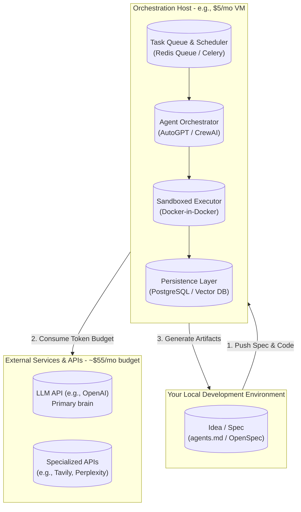

Excellent. This is a well-defined problem, and Deer Flow's architecture provides a powerful blueprint for the solution. Your goal is to transition from real-time supervision to asynchronous oversight, and the core requirement is a robust, self-contained execution environment that can run complex, multi-step tasks reliably.

Based on the provided documentation, here is a comprehensive technical report to achieve your desired "plan and review" workflow within your $60/month budget.

### **Executive Summary**

Deer Flow's value lies not in a single novel algorithm, but in its **integration of proven open-source components into a cohesive "super-agent harness."** Its key features—sandboxed execution, multi-agent orchestration, persistent memory, and an extensible skill library—are all replicable using existing, lower-cost tools. The "$400-$600/month" pricing for a managed service primarily covers infrastructure, maintenance, and the convenience of a pre-integrated stack.

By strategically assembling open-source alternatives and leveraging pay-as-you-go API costs, you can build a system that matches Deer Flow's core capabilities. The primary investment shifts from a subscription fee to **your engineering time for initial setup and ongoing refinement.** Your $60/month budget is realistic, covering API usage (LLM, search, etc.) and potentially a small VM to host the system for 24/7 availability.

### **1. Deconstructing Deer Flow: Core Components for Autonomous Execution**

To replicate the functionality, we must first identify the components that enable Deer Flow's autonomous, overnight execution. The documentation highlights these as critical:

| Core Component                | Deer Flow Implementation                                                                                     | Functional Purpose in Autonomous Workflow                                                                                                                                                       |
| :---------------------------- | :----------------------------------------------------------------------------------------------------------- | :---------------------------------------------------------------------------------------------------------------------------------------------------------------------------------------------- |
| **Sandboxed Environment**     | Isolated Docker containers with a virtual filesystem (`/mnt/user-data/`).                                    | Provides a safe, reproducible, and stateful workspace. The agent can read/write files, run code, and execute bash commands without side effects. This is **fundamental for unsupervised work**. |
| **Multi-Agent Orchestration** | A lead agent spawns parallel sub-agents via `task_tool()`, each with isolated context.                       | Enables complex task decomposition. A high-level plan can be broken down into parallel research, coding, or validation tasks, drastically reducing overall execution time.                      |
| **Extensible Skills System**  | Markdown-based `SKILL.md` files defining workflows and best practices.                                       | Encodes expert knowledge and standard operating procedures. This guides the agent's approach, improving consistency and reducing the need for moment-to-moment prompting.                       |
| **Long-Term Memory**          | Persistent JSON storage (`.deer-flow/memory.json`) of user profile, preferences, and past project knowledge. | Allows the system to learn your coding style, preferred stack, and common patterns over time, making its output more aligned with your expectations without repeated instruction.               |
| **Context Management**        | Middleware for summarization, isolating sub-agent contexts, and offloading to the filesystem.                | Prevents context window overflow during long-running tasks, ensuring the agent remains focused and functional without losing the big picture.                                                   |

### **2. Proposed Architecture Within a $60/Month Budget**

This architecture replaces managed services with open-source alternatives, focusing your budget on variable costs (API tokens) and minimal fixed costs (a small VM).

#### **2.1. Core Component Breakdown & Cost Analysis**

| Component                 | Proposed Open-Source Tool(s)                                          | Justification & Configuration                                                                                                                                                                                                                | Est. Monthly Cost                                         |
| :------------------------ | :-------------------------------------------------------------------- | :------------------------------------------------------------------------------------------------------------------------------------------------------------------------------------------------------------------------------------------- | :-------------------------------------------------------- |
| **Orchestration Host**    | **Hetzner / DigitalOcean Droplet** (Smallest tier: 1-2 vCPU, 2GB RAM) | A 24/7 always-on machine is essential for overnight execution. Your local machine cannot be relied upon to stay awake and online.                                                                                                            | **$4 - $6**                                               |
| **Agent Orchestrator**    | **CrewAI** or **AutoGPT**                                             | Both are popular, actively maintained frameworks for multi-agent collaboration. CrewAI's focus on role-based agents aligns well with Deer Flow's sub-agent concept. AutoGPT's long-term memory and file handling are also strong.            | **$0** (Open Source)                                      |
| **Sandboxed Environment** | **Docker-in-Docker (DinD)**                                           | Run the orchestrator in a container that can spawn child containers for each task. This provides the same isolation and reproducibility as Deer Flow. You can define a base image with your standard development tools (Python, Node, etc.). | **$0** (Open Source)                                      |
| **Persistence & Memory**  | **PostgreSQL** (for state) + **ChromaDB / Qdrant** (for memory)       | Use a simple relational DB to track thread/task state. For long-term memory, a vector database (Chroma) can store embeddings of past projects, preferences, and solutions, enabling semantic retrieval.                                      | **$0** (Open Source)                                      |
| **Task Queue**            | **Redis Queue (RQ) / Celery**                                         | To manage multiple tasks and ensure the system doesn't get overwhelmed, a queue is necessary. This also allows you to implement retries and monitor task status.                                                                             | **$0** (Open Source)                                      |
| **LLM API Costs**         | **OpenAI (GPT-4o) / Anthropic (Claude 3.5 Sonnet)**                   | This is your primary variable cost. For complex, multi-hour tasks, budget accordingly. Overnight runs can be token-heavy. Use less expensive models (e.g., GPT-4o mini) for sub-agents doing focused, simpler tasks to conserve budget.      | **$40 - $50** (Variable)                                  |
| **Search/Research API**   | **Tavily / Perplexity API**                                           | For the "deep research" aspect, a dedicated search API is more reliable than DIY web scraping. Tavily is built for agents.                                                                                                                   | **$0 - $10** (Tavily has a free tier, then pay-as-you-go) |
| **Total**                 |                                                                       |                                                                                                                                                                                                                                              | **~$44 - $71**                                            |

### **3. Implementation Strategy for Autonomous Overnight Execution**

The key is to shift from a synchronous, interactive loop to an asynchronous, event-driven one.

1.  **Specification as Code:** Your current `agents.md` and OpenSpec are the perfect starting point. Formalize them. The input to your system should be a structured file (JSON, YAML, or Markdown with a defined schema) in a Git repository. This spec contains the goal, constraints, success criteria, and perhaps links to relevant code.
2.  **The GitOps Trigger:**
    *   You create a new branch, write your detailed spec, and push it to your repository.
    *   A **webhook** on your repository (GitHub/GitLab) notifies your orchestrator host (the $5 VM) that a new task is ready.
    *   **Alternative:** A simple script on the VM polls the repository for changes in a specific folder every 15 minutes.
3.  **Task Enqueueing:** The webhook handler or poller creates a new task entry in the **Redis Queue**. This task contains the path to the spec and the branch name. This immediately frees you from the process.
4.  **Orchestrator Execution:** The **CrewAI/AutoGPT** orchestrator picks up the task from the queue. It:
    *   Spins up a new **Docker sandbox container**.
    *   Clones the specific branch of your repository into the sandbox's workspace.
    *   Reads the spec.
    *   Begins its planning and delegation, using its allocated LLM budget and tools.
5.  **Artifact Generation & Notification:** As the orchestrator works, it writes code, tests, and documentation back to the repository branch within the sandbox. Upon completion (or failure), it commits and pushes these artifacts back to the branch. It can then send you a notification (e.g., via Discord webhook, email, or Pushover) that the overnight job is done.
6.  **Morning Review:** You pull the branch, review the generated code, tests, and documentation as you would with a human colleague's pull request.

### **4. Enhancing Agent Reliability & Reducing Intervention**

To minimize the need for mid-execution intervention, focus on building a more robust "operating system" for the agent.

*   **Implement a "Plan-Validate-Execute" Loop:** Before the main agent spawns any sub-agent, force it to output a **detailed plan** and **self-validate** it against the spec and available tools. This plan can be stored as an artifact. This makes its thinking process explicit and reviewable *post-hoc*, without requiring you to watch it live.
*   **Structured Delegation with "Skills":**
    *   Recreate the Deer Flow `SKILL.md` concept. In your orchestrator's prompts, define clear roles for sub-agents. For example: `Senior Frontend Specialist`, `Database Schema Designer`, `API Integration Expert`.
    *   The lead agent's task is to write a "job description" (including context, success criteria, and file paths) for these specialist sub-agents, not to micromanage them. This is the key to parallelism and focus.
*   **Comprehensive Logging & Checkpointing:**
    *   Log *everything* the agent does: every tool call, every LLM request/response, every file written. Use a structured logging format (JSON) and ship these logs to a central location (e.g., the VM's disk, or a cheap log aggregation service).
    *   Implement **checkpoints**. After each major phase (planning, frontend work, backend work), the system should commit all changes and save its state. This allows you to resume from a known good point if a later step fails, rather than restarting from scratch.
*   **Automated Testing Harness:** The sandbox should automatically run your project's existing test suite after any code modification. If tests fail, the agent must be instructed to diagnose and fix the failure before proceeding. This is a non-negotiable guardrail for unsupervised coding.
*   **Human-in-the-Loop Exception Handling (Conditional):** For high-stakes decisions (e.g., "I need to delete a large portion of code" or "I've hit an API limit I cannot resolve"), the system can pause and send you a notification with a summary and a prompt for a yes/no decision. This is a fallback, not the default mode.

### **5. A Phased Roadmap**

1.  **Phase 1: Foundation (Weeks 1-2) - Cost: ~$5**
    *   Set up the $5 VM. Install Docker, Python, and Git.
    *   Create a simple Python script that can clone a repo, run a single, pre-defined LLM prompt on a file, and commit the result. Trigger it manually via SSH. Prove the basic GitOps loop works.
2.  **Phase 2: Orchestration (Weeks 3-4) - Cost: ~$5 + API Costs**
    *   Integrate a simple CrewAI flow. Start with a single agent that can read a spec file (e.g., `TODO.md`) and perform one type of task (e.g., "write a Python function for this problem").
    *   Implement the task queue (Redis Queue) so you can submit tasks without blocking.
3.  **Phase 3: Sandboxing & Memory (Weeks 5-6) - Cost: ~$5 + API Costs**
    *   Dockerize the agent execution. The orchestrator lives outside, but spawns a new container for each task run.
    *   Implement a basic memory vector store. After each task, summarize what was done and the key decisions, embed it, and store it. Before a new task, have the lead agent query this memory for relevant past patterns.
4.  **Phase 4: Multi-Agent & "Skills" (Weeks 7-8) - Cost: ~$5 + API Costs**
    *   Expand the CrewAI setup to include a manager agent and 2-3 specialist sub-agents.
    *   Create your first "skills" as system prompts for these sub-agents (e.g., a `SKILL_FRONTEND_REACT.md` prompt that is loaded when frontend work is detected).
5.  **Phase 5: The Overnight Workflow (Week 9+) - Cost: ~$5 + API Costs**
    *   Fully automate the trigger via webhooks.
    *   Implement the "plan-validate-execute" loop and automated testing.
    *   Set up the notification system (Discord).
    *   Run your first unsupervised overnight task with a well-defined, low-risk spec.

By following this roadmap, you will build a system tailored to your exact workflow. The initial investment is time, but the long-term payoff is a shift to the high-level, strategic role of a "director of AI agents," operating well within your $60 budget. This approach is demonstrably more complex to set up than using a tool like Copilot, but it is precisely this complexity that grants you the level of autonomous control you are seeking.

---

## Official / 2026 links

- [GitHub `bytedance/deer-flow`](https://github.com/bytedance/deer-flow) · [deerflow.tech](https://deerflow.tech/)
- [`research_overnight_stack_web/findings_orchestration_deer_agentflow_gas.md`](research_overnight_stack_web/findings_orchestration_deer_agentflow_gas.md)
