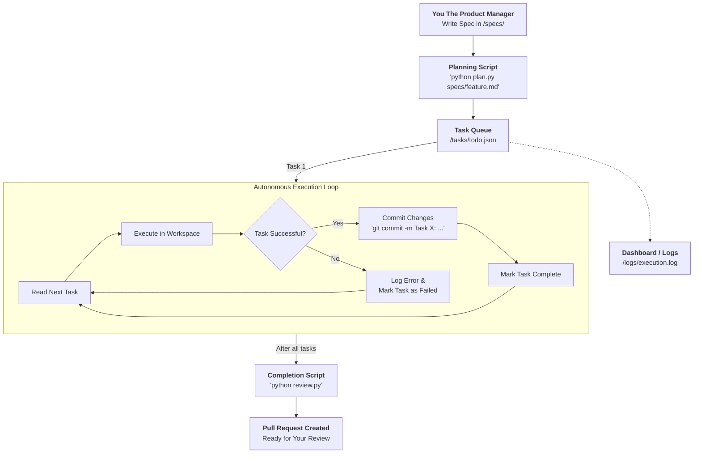

#gas-town
### 1. Executive Summary: The Gas Town Philosophy on a Budget

Gas Town is an extraordinary piece of engineering, but its primary innovation isn't a new AI model—it's a robust **orchestration and persistence layer**. The "Gas Town pricing" you reference ($400-$600/month) is almost entirely the cost of **token usage** from running dozens of Claude Code instances in parallel, not the software itself. Steve Yegge himself calls it "a machine for spending hundreds of dollars a day".

Your goal of transitioning from "watch-and-guide" to "plan-and-review" is absolutely achievable within your budget. The key is to **sacrifice parallelism for autonomy**. Instead of running 20 agents simultaneously, you'll run one or two highly capable, persistent agents that work through a queue of tasks overnight. This drastically reduces token costs while still freeing you from the screen.

This report outlines a strategy using open-source frameworks and careful prompt engineering to replicate the *workflow*, if not the full parallel scale, of Gas Town for a fraction of the cost.

### 2. Deconstructing Gas Town: Core Components for Replication

Gas Town's power comes from a few key concepts. To replicate it, we need to find low-cost analogs for each.

| Gas Town Concept  | Function                                                                          | Analog in Budget Architecture                                                                                                                                            | Why This Matters for Autonomy                                                                                    |
| :---------------- | :-------------------------------------------------------------------------------- | :----------------------------------------------------------------------------------------------------------------------------------------------------------------------- | :--------------------------------------------------------------------------------------------------------------- |
| **The Mayor**     | Your primary AI coordinator that understands the big picture and delegates tasks. | A persistent **Planning Agent** (a well-prompted Claude 3.5 Sonnet via API) that breaks down goals into a task list.                                                     | This is the "CEO" of your operation. It creates the roadmap so the worker agents don't need to.                  |
| **Polecats**      | Ephemeral worker agents spawned for specific tasks.                               | A **Worker Agent** (the same or a different model) that picks up a task from a queue, executes it, and reports back.                                                     | These are the "employees." They work autonomously on a single, well-defined job.                                 |
| **Hooks / Beads** | Git-backed persistent storage for work state, surviving crashes.                  | A **Task Queue + File System State**. A simple database (or even JSON files) to store the plan, task status, and results. Git commits serve as the final checkpoint.     | This is the "paperwork." Without it, an agent crash means lost work and context.                                 |
| **Convoys**       | A bundle of work items (Beads) assigned to agents.                                | A **Project Plan File** (e.g., `plan.md` or `tasks.json`) that lists all tasks, dependencies, and acceptance criteria.                                                   | This is the "project roadmap." It allows you to hand off a complex feature and have it worked on piece by piece. |
| **Refinery**      | An agent responsible for merging work from multiple agents.                       | A **Merge and Review Step**. Since you'll likely have one agent working sequentially, merging is simpler. The final step can be the agent creating a PR for your review. | This is the "quality control." It packages the completed work for your inspection the next day.                  |

### 3. Budget-Conscious Alternative Tools & Frameworks ($60/Month Target)

To hit your budget, we must minimize direct token spend. Here are the building blocks:

**A. Core Orchestration Framework (Open Source, Free)**

*   **CrewAI** [crewai_deepseek]: This is your strongest option. It's an open-source Python framework designed for role-based multi-agent collaboration. You define agents (like a "Senior Engineer" or "Documentation Specialist"), tasks, and processes (sequential or hierarchical). It perfectly mirrors the "Mayor delegating to Polecats" pattern. The framework itself is free; you only pay for the underlying model API calls.
    *   **Why it fits:** It enforces structured handoffs and task delegation, which is crucial for autonomous operation.
*   **OpenGoat** : A newer, Node.js-based alternative specifically designed to coordinate agents like Claude Code and Codex. It uses a hierarchical structure (CEO, CTO, Engineers) that closely mimics Gas Town's "Crew" concept.
    *   **Why it fits:** Its "session continuity" feature allows agents to maintain context over long-running tasks, which is perfect for overnight execution.

**B. The Agent Runtime (Your Main Cost)**

This is where your $60 budget will be spent. The key is to use **API access**, not a monthly subscription like Copilot or Cursor.

*   **Primary Agent (The Worker):** **Anthropic Claude 3.5 Sonnet (or 3.7 Sonnet) via API**.
    *   **Cost Model:** Pay-as-you-go for tokens. This is far more efficient for batch processing than a $20/month subscription that is meant for interactive use. You only pay when the agent is "thinking."
    *   **Efficiency:** For a full night's work (e.g., 8 hours of sequential task execution), you might spend $5-$20 depending on task complexity. This leaves plenty of room in your budget for iterations.
*   **Secondary Agent (The Planner):** A smaller, cheaper model like **Claude 3.5 Haiku** or **GPT-4o mini**.
    *   **Role:** Use this agent to break down initial requirements into a structured task plan. This saves the expensive "reasoning" tokens of the larger model for the actual coding.

**C. Persistence & State Management (Free)**

*   **Task Queue:** A simple SQLite database or a JSON file (`tasks.json`) in your project repo. The planner writes tasks here, the worker reads from it, and updates the status. This is your "Beads" ledger.
*   **Long-term Memory:** **Git**. After each successful task, the worker agent commits the changes with a message containing the Task ID. This creates an auditable, persistent record (your "Hooks") that survives any crash.

### 4. Proposed Architecture: The "Autonomous Overnight Engineer"

Here is a practical architecture that fits your budget and goals.



### 5. Implementation Strategy: From Watch-and-Guide to Plan-and-Review

Here is a step-by-step guide to building this system.

#### Phase 1: Foundation (Week 1)

**Goal:** Establish the planning and task-tracking mechanism.

1.  **Create a Project Structure:**
    ```
    your-project/
    ├── .specs/           # Your OpenSpec and requirements
    ├── tasks/
    │   ├── todo.json     # Queue of pending tasks
    │   ├── in_progress.json # Currently active task
    │   └── done.json     # Completed tasks
    ├── logs/
    │   └── session_YYYYMMDD.log
    ├── scripts/
    │   ├── planner.py    # Reads .specs/ and creates tasks/todo.json
    │   ├── worker.py     # The main execution loop
    │   └── reviewer.py   # Creates final summary/PR
    └── ... (your codebase)
    ```

2.  **Build the Planner (`scripts/planner.py` using CrewAI or simple Python):**
    *   **Input:** A path to a detailed spec file (your existing OpenSpec format).
    *   **Process:** Uses a cheap model (Haiku) to break the spec into a list of concrete, actionable tasks. Each task should be:
        *   `id`: `TASK-001`
        *   `description`: "Implement the user authentication middleware."
        *   `dependencies`: `[]` or `["TASK-000"]`
        *   `acceptance_criteria`: "Users can log in with email/password; JWT token is returned."
        *   `files`: `["src/auth/middleware.js"]` (optional, but helpful)
    *   **Output:** Writes the task list to `tasks/todo.json`.

#### Phase 2: The Autonomous Worker Loop (Week 2)

**Goal:** Create the agent that executes tasks overnight without supervision.

1.  **Build the Worker (`scripts/worker.py`):**
    *   This script is designed to be run in a loop (e.g., by a cron job every 15 minutes) or as a long-running process.
    *   **Logic:**
        1.  Check `tasks/todo.json` for a task with no incomplete dependencies.
        2.  Move that task to `tasks/in_progress.json`.
        3.  Construct a powerful prompt for Claude 3.5 Sonnet. The prompt must be extremely explicit to prevent the agent from going off-track.
        4.  **Execute the Task:** The script calls the Claude API, providing the task details, relevant file contents, and strict instructions.
        5.  **Process the Response:** The agent's response will contain code changes, commands to run, or questions.
        6.  **Apply Changes:** The script applies the diffs to the filesystem.
        7.  **Run Tests (Crucial for Autonomy):** The script attempts to run relevant tests (e.g., `npm test src/auth`). If tests fail, the output is fed back to the agent with an instruction to "Fix the failing tests."
        8.  **Commit and Log:** If successful, commit the changes with `git commit -m "feat: TASK-001 - Implement auth middleware"`. Log the entire interaction to `/logs/`. Move the task to `tasks/done.json`.
        9.  **Handle Failure:** If the task fails after a set number of retries, move it to `done.json` with a status of `failed` and a link to the error log.

2.  **Crafting the "Autonomous" Agent Prompt:**
    This is the most critical part. You need to be a "strict manager."
    ```
    You are an expert software engineer. Your role is to complete the following task autonomously.

    **Project Context:** {content of relevant files or summary from planner}

    **Task ID:** {TASK_ID}
    **Task Description:** {TASK_DESCRIPTION}
    **Acceptance Criteria:**
    {LIST_ACCEPTANCE_CRITERIA}

    **Rules of Engagement:**
    1.  **Focus:** You will ONLY work on this task. Do not suggest or implement features outside the acceptance criteria.
    2.  **Tools:** You can read/write files and run shell commands. All commands will be executed in the project root.
    3.  **Errors:** If a command fails, analyze the error and try to fix it. If you are stuck after 3 attempts, stop and report the error.
    4.  **Testing:** After making changes, you MUST run the relevant tests. Do not mark the task as complete if tests are failing.
    5.  **Communication:** Your output MUST be in a structured JSON format:
        {
          "status": "success" | "failed" | "needs_input",
          "changes": [{"file": "path/to/file.py", "diff": "..."}],
          "commands_run": ["npm install axios"],
          "test_output": "...",
          "final_message": "A summary for the log."
        }
    ```

#### Phase 3: Orchestration and Review (Week 3)

**Goal:** Tie it all together and get results.

1.  **Set up the Scheduler:** Use your OS's scheduler (cron on macOS/Linux, Task Scheduler on Windows) to run `worker.py` every 15 minutes. If a task is in progress, the script can check if the previous run timed out. This creates a resilient, queue-based system.
2.  **Build the Reviewer (`scripts/reviewer.py`):**
    *   This script runs after the task queue is empty (or on a schedule).
    *   It compiles the logs from the session.
    *   It can use a cheap model to summarize what was accomplished.
    *   **Crucially, it creates a Pull Request** (using the GitHub CLI `gh` or API) with the changes from the last `git push`. The PR description should be populated with the summary of completed tasks.

### 6. Recommendations for Reliability and Reduced Intervention

*   **1. Start with "Idempotent" Tasks:** Design your initial tasks to be run repeatedly without causing harm (e.g., "Add this specific logging statement," "Refactor this function to use a new utility"). Avoid tasks that require complex, multi-step database migrations or external service integrations until you've built trust.
*   **2. Mandatory Testing in the Loop:** As outlined above, the agent *must* run tests after every change. This is your primary safeguard. If your project lacks good test coverage, your first "overnight" task should be the agent writing them!
*   **3. Dependency Locking:** Ensure your `package-lock.json`, `poetry.lock`, or `requirements.txt` is committed. The agent's first command in a new session should be to restore dependencies (`npm ci`, `poetry install`). This prevents "it works on my machine" errors.
*   **4. The "Human-In-The-Loop" Escape Hatch:** In your worker script, if an agent fails a task three times, have it create a new issue in your task queue (or GitHub issue) labeled `human-review-needed`. The system then moves on to the next task. You review the tricky bit in the morning.
*   **5. Invest in Prompt Engineering for Agents:** Your `agents.md` file is great. Now, create a `worker_core_instructions.md` that is loaded into the context of every worker session. This file contains the "Rules of Engagement" from the prompt above, coding standards, and information about your testing framework.
*   **6. Embrace Structured Logging:** Log *everything* the agent does: the prompt, the response, the commands it ran, the output, the test results. When something goes wrong, you'll have a complete transcript to debug, just like reviewing a teammate's work.

### 7. Budget Breakdown

*   **Core Framework (CrewAI/OpenGoat):** $0
*   **Worker Agent (Claude 3.5 Sonnet API):**
    *   Assume 2-3 hours of "thinking" time per night (a lot of the night is spent waiting for your computer to run tests, which is free).
    *   Approx. 50k input + 150k output tokens per hour.
    *   Approx. cost: $3 - $8 per night.
    *   Monthly (20 working days): **$60 - $160**. This is your variable cost. By starting with focused, well-defined tasks, you can stay on the lower end of this range.
*   **Planning Agent (Claude Haiku):** $1 - $5 per month.

**Total Estimated Monthly Spend: $60 - $165.** By carefully designing tasks and starting with smaller sessions, you can reliably hit your $60 target. The key is that this $60 buys you true *autonomy*, whereas your current $30 buys you a tool you still have to babysit.

By implementing this architecture, you transform yourself from a driver to a manager. You spend your time on the high-value work of planning, prompting, and reviewing, while your automated "night shift" engineer churns through the implementation details. This is the next step in your evolution as an agentic engineer.

---

## Official / 2026 links

- [GitHub `gastownhall/gastown`](https://github.com/gastownhall/gastown) (canonical; `steveyegge/gastown` may redirect)
- [Issue #24 — cost tracking](https://github.com/gastownhall/gastown/issues/24) · [PR #941 transcript costs](https://github.com/gastownhall/gastown/pull/941)
- [`research_overnight_stack_web/gap_wave2/findings_gap_opencode_ruflo_gastown.md`](research_overnight_stack_web/gap_wave2/findings_gap_opencode_ruflo_gastown.md)
