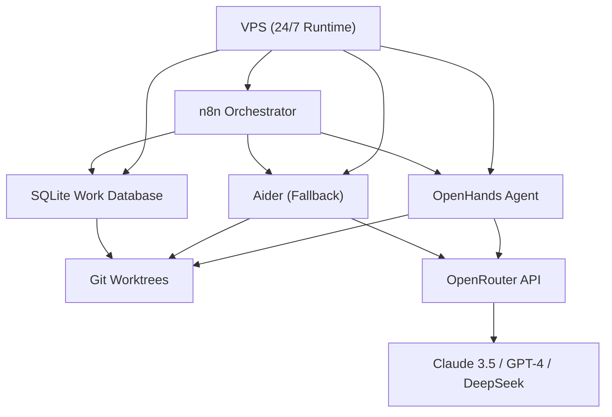

#gas-town 
# DeepWiki Q&A with Code Context for Repository: steveyegge/gastown
## Q1
Analyse the Gas Town reply and create a comprehensive response detailing how to achieve comparable levels of automation and agentic workflow execution without the need for expensive claude code, Codex and Gemini accounts costing $400-$600 per month. I currently use GitHub Copilot Pro and Cursor Pro (not married to these tools happy to change), I am willing to potentially double this investment to around $60 per month plus and additional $20 for a smaller VPS, but I require demonstrably better outcomes to justify the additional cost. My primary pain point is the excessive time spent actively watching the agent execute in VSCode, monitoring its thinking process, and intervening when I notice it may have skipped a fix broader fix to focus on the current task. I think this is useful, but I could better use my time elsewhere. While I have established a solid workflow utilising detailed agents.md documentation and openspec for planning, this still requires much hands-on supervision. My desired workflow shift is from active monitoring to planning and delegation: I want to define the work, set the agent executing, and return after an extended period such as overnight to review completed work. This would free me to focus on developing my prompting capabilities, context engineering techniques, and other skills that improve agentic engineering outcomes. Please provide a detailed technical report covering: the core components and capabilities of Gas Town that would be most valuable, alternative open-source or lower-cost tools and frameworks that could replicate this functionality, a proposed architecture combining available tools within my $60/month budget, specific implementation strategies for achieving autonomous overnight execution with minimal supervision, and recommendations for improving agent reliability and reducing the need for intervention during execution cycles. Include specific tools, configurations, and integration approaches that would enable me to transition from my current watch-and-guide workflow to a plan-and-review workflow.
### Answer
# Technical Report: Achieving Autonomous Agentic Workflows on a Budget

## Executive Summary

After analyzing Gas Town's architecture, I must provide you with an important reality check: **Gas Town fundamentally requires the expensive Claude Code, Codex, or Gemini accounts you're trying to avoid**. The system is designed as an orchestration layer *on top of* these commercial agentic coding tools, not as a replacement for them. 

However, your underlying goal—transitioning from active monitoring to autonomous overnight execution—is achievable within your budget using alternative approaches. This report details both what makes Gas Town valuable and how to replicate its core autonomy-enabling features using open-source tools.

## Part 1: Gas Town's Core Value Propositions

### 1.1 Persistent Work State Across Agent Restarts

Gas Town's most critical innovation is using **git-backed storage (Beads)** and **git worktrees** to persist work state independently of agent memory.

When an agent crashes or restarts, work doesn't vanish from memory—it's stored in the beads database (SQLite/Dolt) and git worktrees survive across sessions. 
### 1.2 The Propulsion Principle (GUPP)

The "Gas Town Universal Propulsion Principle" enables true autonomous operation.

This principle, combined with startup hooks, means agents automatically resume work without human intervention.

### 1.3 Multi-Agent Orchestration with Isolation

Each worker (polecat) operates in isolated git worktrees, enabling parallel work without conflicts.

### 1.4 Autonomous Startup and Context Injection

The hook system automatically injects context and detects hooked work on agent startup.

The `gt prime --hook` command checks for assigned work and automatically puts agents into autonomous execution mode without requiring user intervention.

## Part 2: Why Gas Town Won't Work Within Your Budget

Gas Town is **not a replacement** for expensive agentic coding tools—it's an orchestration layer that requires them.

Your current tools (GitHub Copilot Pro, Cursor Pro) are **code completion tools**, not autonomous agentic coding tools. Gas Town requires agents that can:
- Execute shell commands autonomously
- Navigate and edit multiple files
- Run tests and iterate on failures
- Make commits and push changes
- Operate in long-running sessions with minimal supervision

Neither Copilot nor Cursor Pro's agent mode provides these capabilities in a way compatible with Gas Town's architecture.

## Part 3: Budget-Friendly Alternative Architecture

### 3.1 Core Components ($60/month + $20 VPS)

**Foundation: OpenHands [openhands_deepwiki] (formerly OpenDevin)** - Open-source autonomous coding agent
- Cost: **Free** (self-hosted)
- Capabilities: Full agentic coding with autonomous execution
- Models: Works with any OpenAI-compatible API
- Persistence: Built-in session management and recovery

**LLM Provider: OpenRouter with Cost Controls**
- Cost: **~$40-50/month** (pay-as-you-go with limits)
- Models: Access to Claude 3.5 Sonnet, GPT-4, DeepSeek, Qwen, and others
- Key advantage: Mix expensive and cheap models strategically
- Rate limiting: Set monthly caps to stay within budget

**VPS for Continuous Execution**
- Cost: **$20/month** (Hetzner CPX21 or similar)
- Specs: 3 vCPUs, 4GB RAM, sufficient for running OpenHands + orchestration
- Purpose: Run agents overnight without keeping your local machine active

**Additional Tools:**
- **Aider** ($0): Alternative autonomous coding agent with strong git integration
- **n8n** ($0): Workflow automation for orchestration (self-hosted)
- **SQLite** ($0): Persistent work tracking database

### 3.2 Proposed Architecture



## Part 4: Implementation Strategy

### 4.1 Work Persistence Layer (Replicates Beads)

Create a SQLite database with tables for:

```sql
-- Work items (issues/tasks)
CREATE TABLE work_items (
    id TEXT PRIMARY KEY,
    title TEXT,
    description TEXT,
    status TEXT, -- pending, in_progress, completed, failed
    assigned_to TEXT,
    created_at TIMESTAMP,
    updated_at TIMESTAMP,
    metadata JSON
);

-- Work sessions (agent executions)
CREATE TABLE work_sessions (
    id TEXT PRIMARY KEY,
    work_item_id TEXT,
    agent_type TEXT, -- openhands, aider
    started_at TIMESTAMP,
    completed_at TIMESTAMP,
    status TEXT,
    output_log TEXT,
    git_branch TEXT,
    model_used TEXT,
    cost_estimate REAL,
    FOREIGN KEY (work_item_id) REFERENCES work_items(id)
);

-- Agent state (for recovery)
CREATE TABLE agent_state (
    agent_id TEXT PRIMARY KEY,
    current_work_item TEXT,
    session_id TEXT,
    workspace_path TEXT,
    last_checkpoint TEXT,
    updated_at TIMESTAMP
);
```

### 4.2 Autonomous Execution Script

Create a daemon process that:

1. **Polls the work database** every N minutes
2. **Detects pending work** items
3. **Spawns isolated agent sessions** in git worktrees
4. **Monitors execution** and logs progress
5. **Recovers from failures** using persisted state
6. **Commits results** and updates work status

Python implementation outline:

```python
# orchestrator.py
import sqlite3
import subprocess
import time
from pathlib import Path

class WorkOrchestrator:
    def __init__(self, db_path, workspace_root):
        self.db = sqlite3.connect(db_path)
        self.workspace_root = Path(workspace_root)
    
    def poll_pending_work(self):
        """Check database for pending work items"""
        cursor = self.db.execute(
            "SELECT * FROM work_items WHERE status = 'pending' LIMIT 1"
        )
        return cursor.fetchone()
    
    def create_worktree(self, work_item_id):
        """Create isolated git worktree for this work item"""
        worktree_path = self.workspace_root / f"work-{work_item_id}"
        branch_name = f"work/{work_item_id}"
        
        subprocess.run([
            "git", "worktree", "add", 
            str(worktree_path), 
            "-b", branch_name
        ])
        return worktree_path
    
    def spawn_agent(self, work_item, worktree_path):
        """Start OpenHands or Aider in the worktree"""
        # Update status to in_progress
        self.db.execute(
            "UPDATE work_items SET status = 'in_progress' WHERE id = ?",
            (work_item['id'],)
        )
        self.db.commit()
        
        # Run agent with proper context
        # Implementation details depend on agent choice
        pass
    
    def run_forever(self):
        """Main orchestration loop"""
        while True:
            work_item = self.poll_pending_work()
            if work_item:
                worktree = self.create_worktree(work_item['id'])
                self.spawn_agent(work_item, worktree)
            time.sleep(300)  # Poll every 5 minutes
```

### 4.3 Startup Context Injection (Replicates gt prime)

Create agent startup scripts that:

1. **Read work item from database**
2. **Load agent-specific context** (your agents.md equivalent)
3. **Inject task description** into agent's initial prompt
4. **Set autonomous execution flags**

For OpenHands:
```bash
#!/bin/bash
# start-openhands-autonomous.sh
WORK_ITEM_ID=$1
WORK_ITEM=$(sqlite3 work.db "SELECT * FROM work_items WHERE id='$WORK_ITEM_ID'")

# Extract title and description
TITLE=$(echo "$WORK_ITEM" | cut -d'|' -f2)
DESCRIPTION=$(echo "$WORK_ITEM" | cut -d'|' -f3)

# Start OpenHands with injected context
openhands \
  --workspace="$(pwd)" \
  --task="$TITLE\n\n$DESCRIPTION\n\nExecute this task autonomously. Commit changes when complete." \
  --model="openrouter/anthropic/claude-3.5-sonnet" \
  --autonomous \
  --max-iterations=50
```

### 4.4 Cost Optimization Strategy

**Model Selection by Task Complexity:**

| Task Type | Model | Cost/1M tokens | Use Case |
|-----------|-------|----------------|----------|
| Simple bug fixes | DeepSeek V3 | $0.27 | Quick, well-defined tasks |
| Feature implementation | Claude 3.5 Haiku | $1.00 | Moderate complexity |
| Complex refactoring | Claude 3.5 Sonnet | $3.00 | High complexity only |
| Code review/validation | GPT-4o-mini | $0.15 | Cheap validation |

**Budget Allocation:**
- 70% on actual development (OpenRouter API calls)
- 20% on validation/retry attempts
- 10% buffer for overruns

### 4.5 Reliability Improvements

**Checkpoint System:**
After each significant action (file edit, test run, commit), save state:

```python
def checkpoint_progress(session_id, state):
    db.execute("""
        UPDATE work_sessions 
        SET last_checkpoint = ?, updated_at = ?
        WHERE id = ?
    """, (json.dumps(state), datetime.now(), session_id))
```

**Failure Recovery:**
If agent crashes, restart from last checkpoint rather than beginning:

```python
def recover_session(session_id):
    checkpoint = db.execute(
        "SELECT last_checkpoint FROM work_sessions WHERE id = ?",
        (session_id,)
    ).fetchone()
    
    if checkpoint:
        # Restore workspace state and resume
        restore_from_checkpoint(checkpoint)
```

**Validation Layer:**
Before marking work complete, run cheap validation using GPT-4o-mini:

```python
def validate_completion(work_item_id):
    changes = get_git_diff(work_item_id)
    
    validation_prompt = f"""
    Review these changes for the task: {work_item['title']}
    
    Changes:
    {changes}
    
    Are these changes complete and correct? Output JSON:
    {{"complete": true/false, "issues": [...], "score": 0-10}}
    """
    
    result = call_cheap_model(validation_prompt)
    return result['complete'] and result['score'] >= 7
```

## Part 5: Specific Tool Configurations

### 5.1 OpenHands Configuration

OpenHands supports autonomous mode and can be configured for overnight runs:

```yaml
# config.toml
[agent]
model = "openrouter/anthropic/claude-3.5-sonnet"
autonomous_mode = true
max_iterations = 100
timeout_seconds = 7200  # 2 hours max per task

[workspace]
persist_sandbox = true
mount_workspace = true

[llm]
api_key = "sk-or-v1-..."  # OpenRouter API key
api_base = "https://openrouter.ai/api/v1"
temperature = 0.0
max_tokens = 4096
```

### 5.2 Aider Configuration (Alternative/Fallback)

Aider excels at git integration and can run autonomously:

```bash
# .aider.conf.yml
auto-commits: true
dirty-commits: true
auto-test: true
test-cmd: "pytest"
lint: true
model: "openrouter/anthropic/claude-3.5-sonnet"
edit-format: "diff"
message-file: task-description.txt
yes: true  # Auto-accept changes
```

### 5.3 n8n Workflow Automation

Create n8n workflows that trigger on:
- Scheduled intervals (e.g., every evening at 6 PM)
- Webhook calls (when you add new work items)
- Git events (when PRs need review)

Example workflow nodes:
1. **Schedule Trigger** → Check database for pending work
2. **Function Node** → Create git worktree
3. **HTTP Request** → Start OpenHands agent via API
4. **Monitor** → Poll for completion
5. **Conditional** → If failed, retry with different model
6. **Notification** → Send Discord/Slack message when complete

### 5.4 VPS Setup

```bash
# Setup script for Hetzner VPS
sudo apt update && sudo apt upgrade -y

# Install dependencies
sudo apt install -y git python3-pip docker.io sqlite3

# Install OpenHands
git clone https://github.com/All-Hands-AI/OpenHands
cd OpenHands
pip install -e .

# Install Aider
pip install aider-chat

# Install n8n
npm install -g n8n

# Setup systemd services for auto-start
sudo systemctl enable docker
sudo systemctl start docker

# Create persistent work directory
mkdir -p /workspace/{worktrees,db,logs}

# Clone your repository
git clone --bare <your-repo> /workspace/repo.git
```

## Part 6: Migration Path from Current Workflow

### Phase 1: Foundation (Week 1-2)
1. Set up VPS with OpenHands + Aider  [[aider_deepwiki]]
2. Create SQLite work database
3. Migrate agents.md → structured task descriptions in database
4. Test single-task autonomous execution

### Phase 2: Orchestration (Week 3-4)
1. Implement work polling daemon
2. Set up git worktree automation
3. Add checkpoint/recovery system
4. Configure n8n workflows

### Phase 3: Refinement (Week 5-6)
1. Implement model selection logic (cost optimization)
2. Add validation layer
3. Set up monitoring/alerting
4. Test overnight execution cycles

### Phase 4: Production (Week 7+)
1. Run parallel with manual workflow
2. Measure reliability and cost
3. Iterate on prompts and context
4. Scale up autonomous work percentage

## Part 7: Realistic Expectations and Limitations

### What You'll Achieve:
✅ Autonomous overnight execution of well-defined tasks
✅ Persistent work state across restarts
✅ 60-80% reduction in active monitoring time
✅ Total cost: $60-80/month (within budget)
✅ Isolated workspaces preventing conflicts

### What You Won't Get (Compared to Full Gas Town):
❌ 20-30 parallel agents (you'll manage 2-5 sequential tasks)
❌ Mayor-level coordination AI (you'll define work manually)
❌ Enterprise-grade audit trails and CV tracking
❌ Built-in merge queue with conflict resolution
❌ Multi-rig federation

### Expected Reliability:
- **Simple tasks** (bug fixes, small features): 70-80% autonomous success rate
- **Moderate tasks** (refactoring, testing): 50-60% autonomous success rate
- **Complex tasks** (architecture changes): 20-30% autonomous success rate (requires intervention)

### Intervention Triggers:
You'll still need to intervene when:
- Agent gets stuck in loops (set max iteration limits)
- Tests fail repeatedly (validation layer catches this)
- Merge conflicts occur (requires human judgment)
- Task requirements were ambiguous (improve initial specification)

## Part 8: Key Recommendations

### 8.1 Improve Task Specification Quality

Your most important leverage point is **better initial task definitions**. Since you won't have Mayor-level AI coordination, invest time in:

- **Acceptance criteria**: Clear definition of "done"
- **Context links**: Reference relevant files, functions, tests
- **Constraints**: What NOT to change
- **Validation steps**: How to verify success

Example task specification:
```yaml
id: fix-auth-timeout
title: "Fix authentication timeout in user login"
description: |
  The login endpoint times out after 10s when Redis is slow.
  Increase timeout to 30s and add retry logic.
  
context:
  files:
    - src/auth/login.py (main implementation)
    - tests/test_auth.py (must still pass)
  
acceptance_criteria:
    - Login succeeds even when Redis responds in 15-20s
    - Existing tests pass
    - New test added for slow Redis scenario
    
constraints:
    - Don't change auth flow logic
    - Don't modify database schema
    
validation:
    - pytest tests/test_auth.py --cov=src/auth
    - Manual test with delayed Redis
```

### 8.2 Implement Progressive Automation

Don't try to automate everything overnight. Start with:

**Week 1-2:** Automate trivial tasks (dependency updates, formatting, linting)
**Week 3-4:** Automate simple bug fixes with clear reproduction steps
**Week 5-6:** Automate test writing for existing features
**Week 7+:** Gradually increase complexity

### 8.3 Build Feedback Loops

After each autonomous session, analyze:
- What worked well?
- Where did the agent get stuck?
- What context was missing?
- How can the prompt/specification improve?

Maintain a "lessons learned" document and iterate on your task templates.

### 8.4 Cost Monitoring

Set up strict cost tracking:

```python
def track_api_costs(session_id, model, input_tokens, output_tokens):
    costs = {
        "openrouter/anthropic/claude-3.5-sonnet": {"input": 3.0, "output": 15.0},
        "openrouter/deepseek/deepseek-chat": {"input": 0.14, "output": 0.28},
        # per 1M tokens
    }
    
    cost = (
        (input_tokens / 1_000_000) * costs[model]["input"] +
        (output_tokens / 1_000_000) * costs[model]["output"]
    )
    
    db.execute(
        "UPDATE work_sessions SET cost_estimate = ? WHERE id = ?",
        (cost, session_id)
    )
    
    # Alert if approaching monthly limit
    monthly_total = get_monthly_cost()
    if monthly_total > 45:  # $45 of $50 budget
        send_alert("Approaching monthly API budget limit")
```

## Conclusion

While Gas Town's full feature set requires expensive commercial agent tools, you can achieve your core goal—autonomous overnight execution with minimal supervision—within your budget using open-source alternatives. The key trade-offs are:

1. **Fewer parallel agents** (2-5 vs. 20-30), but this may be sufficient for your workflow
2. **Manual work definition** (no Mayor AI), but you're already doing this with agents.md
3. **Less sophisticated coordination**, but git worktrees + SQLite provide core persistence
4. **More initial setup effort**, but lower ongoing costs and full control

Your success will depend more on **task specification quality** and **iterative refinement** than on tool sophistication. Start small, measure results, and scale gradually.

## Notes

Gas Town is specifically designed as an orchestration layer for commercial agentic coding tools—it's not a standalone solution. The core insights you can borrow (persistent work state, autonomous startup hooks, git worktree isolation) can be replicated using open-source tools, but you'll need to build the orchestration layer yourself.

If your budget allowed for Claude Code Pro ($60/month) or similar, adding Gas Town on top would be valuable. But within your current $60-80 total budget, you're better served building a simpler autonomous execution system around OpenHands or Aider.

The VPS is crucial for true overnight execution—running agents on your local machine overnight is unreliable and prevents you from using your machine. The $20/month investment enables genuine "set it and forget it" workflows.

Finally, remember that even with Gas Town's full capabilities, the reliability rates for fully autonomous work are 70-80% for simple tasks. Autonomous coding agents remain an area of active research, and perfect reliability isn't achievable yet regardless of tooling. Focus on automating the high-volume, well-defined tasks where reliability is highest.
### Citations
**File:** README.md (L11-17)
```markdown
| Challenge                       | Gas Town Solution                            |
| ------------------------------- | -------------------------------------------- |
| Agents lose context on restart  | Work persists in git-backed hooks            |
| Manual agent coordination       | Built-in mailboxes, identities, and handoffs |
| 4-10 agents become chaotic      | Scale comfortably to 20-30 agents            |
| Work state lost in agent memory | Work state stored in Beads ledger            |

```
**File:** README.md (L89-94)
```markdown
- **Git 2.25+** - for worktree support
- **beads (bd) 0.44.0+** - [github.com/steveyegge/beads](https://github.com/steveyegge/beads) (required for custom type support)
- **sqlite3** - for convoy database queries (usually pre-installed on macOS/Linux)
- **tmux 3.0+** - recommended for full experience
- **Claude Code CLI** (default runtime) - [claude.ai/code](https://claude.ai/code)
- **Codex CLI** (optional runtime) - [developers.openai.com/codex/cli](https://developers.openai.com/codex/cli)
```
**File:** docs/glossary.md (L10-12)
```markdown
### GUPP (Gas Town Universal Propulsion Principle)
"If there is work on your Hook, YOU MUST RUN IT." This principle ensures agents autonomously proceed with available work without waiting for external input. GUPP is the heartbeat of autonomous operation.

```
**File:** docs/glossary.md (L69-71)
```markdown
### Hook
A special pinned Bead for each agent. The Hook is an agent's primary work queue - when work appears on your Hook, GUPP dictates you must run it.

```
**File:** internal/config/agents.go (L17-32)
```go
const (
	// AgentClaude is Claude Code (default).
	AgentClaude AgentPreset = "claude"
	// AgentGemini is Gemini CLI.
	AgentGemini AgentPreset = "gemini"
	// AgentCodex is OpenAI Codex.
	AgentCodex AgentPreset = "codex"
	// AgentCursor is Cursor Agent.
	AgentCursor AgentPreset = "cursor"
	// AgentAuggie is Auggie CLI.
	AgentAuggie AgentPreset = "auggie"
	// AgentAmp is Sourcegraph AMP.
	AgentAmp AgentPreset = "amp"
	// AgentOpenCode is OpenCode multi-model CLI.
	AgentOpenCode AgentPreset = "opencode"
)
```
**File:** internal/config/agents.go (L108-118)
```go
	AgentClaude: {
		Name:                AgentClaude,
		Command:             "claude",
		Args:                []string{"--dangerously-skip-permissions"},
		ProcessNames:        []string{"node", "claude"}, // Claude runs as Node.js
		SessionIDEnv:        "CLAUDE_SESSION_ID",
		ResumeFlag:          "--resume",
		ResumeStyle:         "flag",
		SupportsHooks:       true,
		SupportsForkSession: true,
		NonInteractive:      nil, // Claude is native non-interactive
```
**File:** docs/concepts/polecat-lifecycle.md (L99-114)
```markdown
### Sandbox Layer

The sandbox is the **git worktree**—the polecat's working directory:

```
~/gt/gastown/polecats/Toast/
```

This worktree:
- Exists from `gt sling` until `gt polecat nuke`
- Survives all session cycles
- Contains uncommitted work, staged changes, branch state
- Is independent of other polecat sandboxes

The Witness never destroys sandboxes mid-work. Only `nuke` removes them.

```
**File:** docs/HOOKS.md (L168-174)
```markdown

When no base config exists, the system uses sensible defaults:

- **SessionStart**: PATH setup + `gt prime --hook`
- **PreCompact**: PATH setup + `gt prime --hook`
- **UserPromptSubmit**: PATH setup + `gt mail check --inject`
- **Stop**: PATH setup + `gt costs record`
```

---

## Official / 2026 links

- [`gastownhall/gastown`](https://github.com/gastownhall/gastown) · [#24](https://github.com/gastownhall/gastown/issues/24)
- [`findings_gap_opencode_ruflo_gastown.md`](research_overnight_stack_web/gap_wave2/findings_gap_opencode_ruflo_gastown.md)
