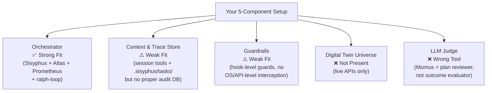
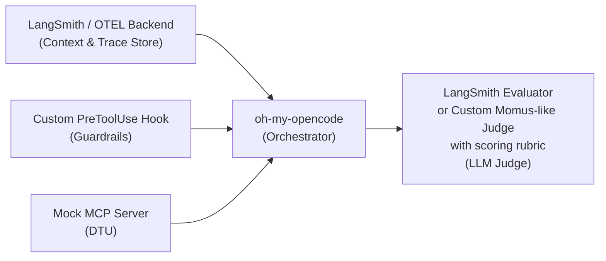

# DeepWiki Q&A with Code Context for Repository: code-yeongyu/oh-my-opencode
## Q1
I am working on an autonomous agentic coding set up to run overnight while I am sleeping so I can review the work in the morning. I have been researching a lot and have come up with a plan broken down into different pieces (based a lot of strongdm's set up where humans don't evaluate the code at all). Furthermore, I already have a highly detailed agents.md and opespec setup, but additionally I am looking at:

Orchestrator:guides agents through structured phases (e.g., design → implement → test → refactor), acting as a high‑level blueprint for autonomous execution.

Context & Trace Store: A database that records every agent action, tool call, and execution trace, providing a shared memory for agents and a complete audit trail for human review.

Guardrails: A safety layer that intercepts and restricts dangerous commands (e.g., rm -rf /, excessive API calls), preventing agents from damaging the project or environment.

Digital Twin Universe (DTU): High‑fidelity, in‑memory clones of external services (like Okta, Slack) used to run thousands of scenarios safely and scalably, eliminating dependency on live APIs and preventing reward hacking.

LLM Judge: An evaluator that reviews execution outcomes against human‑written scenarios and specs, producing a probabilistic “satisfaction” score rather than relying on easily gamed tests.

I am wondering if oh-my-opencode would be a good fit for this setup? I could see it working as the orchestrator and maybe the judge? Why/Why not would it be a good fit. If not please suggest another 2 alternatives
### Answer
# Is `oh-my-opencode` a Good Fit for Your Autonomous Agentic Setup?

The short answer is: **yes for the Orchestrator role, partially for a Judge-like role, and a definitive no for the other three components.** Here is a component-by-component breakdown backed by the actual code.

---

## Component 1: Orchestrator ✅ Strong Fit

This is exactly what `oh-my-opencode` was purpose-built for. The architecture is a genuine multi-phase orchestration system:

```
User Request → Intent Gate → Sisyphus → Prometheus (plan) → Atlas (execute) → subagents
``` oh-my-opencode:54-71 

The orchestration is structured into real phases: `Prometheus` interviews you for planning before any code is written, `Atlas` executes the resulting plan task-by-task, and `Sisyphus` acts as the top-level conductor that delegates to category-based specialist subagents. This directly maps to your design → implement → test → refactor model. oh-my-opencode:108-116 

The `Sisyphus` prompt is itself structured into **Phase 0 (Intent Gate)**, **Phase 1 (Codebase Assessment)**, **Phase 2A (Exploration)**, **Phase 2B (Implementation)**, **Phase 2C (Failure Recovery)**, and **Phase 3 (Completion)** — a genuine blueprint for autonomous execution. oh-my-opencode:188-233 

Critically for an overnight run, the `ralph-loop` (`/ralph-loop`, `/ulw-loop`) provides a self-referential continuation mechanism — it detects a `<promise>DONE</promise>` signal and auto-continues if the agent stops without completion, defaulting to 100 max iterations. oh-my-opencode:389-407 

The `todo-continuation-enforcer` hook acts as a discipline layer that yanks idle agents back on task. oh-my-opencode:712-714 

---

## Component 2: Context & Trace Store ⚠️ Partial and Weak Fit

There is a **session tools** system (`session_list`, `session_read`, `session_search`, `session_info`) and a filesystem-backed task system that stores tasks in `.sisyphus/tasks/` JSON files and survives restarts. oh-my-opencode:519-595 

There is also a `/handoff` command that generates a structured summary for continuing work across sessions, and a `context-window-monitor` hook that tracks token consumption. oh-my-opencode:449-452 oh-my-opencode:642-647 

**However, this is not a proper audit-trail database.** There is no structured store recording every tool call, agent action, and execution trace in a queryable, durable form. The plugin debug log writes to `/tmp/oh-my-opencode.log` — ephemeral and not designed for human review audit trails. oh-my-opencode:131-132 

For your overnight use-case where you need to review everything the next morning, this is a material gap.

---

## Component 3: Guardrails ⚠️ Very Partial Fit

There are several protective hooks, but they are **shallow workflow guards**, not a security interception layer:

- `write-existing-file-guard`: Prevents accidental overwrites of existing files without reading first.
- `non-interactive-env`: Enforces non-interactive flags on shell commands and bans interactive editors/REPLs. oh-my-opencode:54-63 oh-my-opencode:664-670 

- Agent-level tool restrictions: `Oracle` is read-only (cannot write, edit, or delegate), `Librarian` and `Explore` are similarly constrained. oh-my-opencode:43-52 

- `Sisyphus` is hardcoded to deny `call_omo_agent` in its own permission block. oh-my-opencode:556-559 

**But there is no runtime command interception layer** that blocks dangerous bash commands like `rm -rf /`, rate-limits API calls, or halts the agent from pushing to remote git. The guardrails here are prompt-level and permission-level — not OS-level or API-level enforcement. For a fully autonomous overnight run, this is a significant risk gap.

---

## Component 4: Digital Twin Universe (DTU) ❌ Not Present

There is no concept of in-memory service mocks, simulators, or "digital twins" of external APIs anywhere in the codebase. The built-in MCPs (`websearch` via Exa, `context7`, `grep_app`) connect to **live real external services**. oh-my-opencode:770-777 

The Playwright skill connects to real browsers. oh-my-opencode:196-200 

This component is completely absent. You would need to build or integrate this separately (e.g., WireMock, LocalStack, or your own MCP server that stubs external APIs).

---

## Component 5: LLM Judge ⚠️ Misleading Partial Fit

The agent that appears most "judge-like" is `Momus`, a plan reviewer named after the Greek god of satire. oh-my-opencode:7-20 

Momus issues a **binary `[OKAY]` / `[REJECT]` verdict on work plans**, checking only that file references exist and tasks are executable. oh-my-opencode:123-147 

**This is not what you need from an LLM Judge.** Specifically:

1. Momus reviews **plans before execution**, not **outcomes after execution**.
2. It produces a binary verdict, **not a probabilistic satisfaction score**.
3. It does not evaluate against human-written scenarios or specs.
4. Its explicit design goal is to have an "APPROVAL BIAS" — it is not a rigorous evaluator. oh-my-opencode:40-46 

There is no post-execution outcome evaluator anywhere in the codebase. For your setup, this means `Momus` covers pre-flight plan quality but leaves you with no automated morning-review scorecard.

---

## Summary Scorecard



---

## Two Alternatives to Consider

Since `oh-my-opencode` is strong as an **Orchestrator** but leaves 4 of your 5 components either missing or seriously underserved, you should treat it as **one layer** of a larger stack, or replace it entirely with a framework designed for your full-system needs. Here are two alternatives:

---

### Alternative 1: **LangGraph + LangSmith**

**LangGraph** (by LangChain) is a stateful multi-agent orchestration framework built around a **graph of nodes and edges** representing your phases (design → implement → test → refactor). Each node is an agent or tool call; edges are conditional transitions.

- **Orchestrator**: LangGraph's `StateGraph` natively models your structured phases as a DAG with checkpoints and state persistence — much more explicit than `oh-my-opencode`'s prompt-driven phases.
- **Context & Trace Store**: LangSmith, LangGraph's companion, records every LLM call, tool invocation, input/output, and latency into a queryable, web-viewable trace store — exactly your "complete audit trail for human review in the morning."
- **Guardrails**: LangGraph supports interrupt-before/interrupt-after nodes, meaning you can insert a guardrail node that pattern-matches tool inputs (e.g., regex on bash commands) and blocks or escalates them before execution.
- **LLM Judge**: LangSmith has a first-class **evaluator** primitive that runs an LLM against a dataset of human-written examples and produces numeric scores (including custom rubric-based scoring). This is the closest off-the-shelf match to your "probabilistic satisfaction score."
- **DTU**: Not built-in, but LangGraph's MCP-compatible tool abstraction makes it easy to swap live-API tools for mock-tool implementations at the graph edge level.

**Limitation**: You lose `oh-my-opencode`'s battle-tested model routing, hash-anchored edits, and the entire built-in toolchain (LSP, AST-grep, Hashline). You would need to rebuild that tooling.

---

### Alternative 2: **Microsoft AutoGen v0.4 (AgentChat) + Azure AI Foundry Tracing**

**AutoGen v0.4** is Microsoft's rearchitected multi-agent framework with an async, event-driven runtime.

- **Orchestrator**: AutoGen's `GroupChat` or `Swarm` patterns support a `SelectorGroupChat` that routes between agents based on the current phase — a direct structural parallel to Sisyphus delegating to category-based specialists. The `Termination` conditions system is similar to `ralph-loop`'s completion detection.
- **Context & Trace Store**: AutoGen v0.4 has a built-in `ChatHistory` store and integrates with **OpenTelemetry** natively, meaning every agent message, tool call, and event is traceable to any OTEL backend (Jaeger, Azure Monitor, Grafana Tempo). This is a far more production-grade audit trail than `oh-my-opencode`'s session files.
- **Guardrails**: AutoGen supports **custom message interception** via its middleware pattern on the `Runtime`. You can intercept every `ToolCallMessage` before dispatch and apply a blocklist (e.g., reject `rm -rf`, cap API call counts).
- **LLM Judge**: AutoGen has an experimental `MagenticOne` orchestrator pattern that includes a dedicated "Orchestrator-as-judge" component that tracks goal completion. Paired with Azure AI Foundry's evaluation pipelines, you can run rubric-based scoring across scenarios.
- **DTU**: AutoGen's `CancellationToken`-aware tool execution layer makes it straightforward to stub out external tool implementations for simulation mode vs. live mode using a DI-style tool registry.

**Limitation**: AutoGen has a steeper learning curve than `oh-my-opencode`, lacks the turnkey multi-model routing (you configure models explicitly per agent), and has no equivalent to `oh-my-opencode`'s Hashline edit fidelity improvement or built-in LSP tools.

---

## Recommended Approach for Your Use Case

Given you already have a detailed `AGENTS.md` and openspec setup, the pragmatic path is a **hybrid**:



Use `oh-my-opencode` as your **Orchestrator** (it is genuinely excellent at this), and build or bolt on the remaining 4 components. The `PreToolUse` hook system is your cleanest integration point for guardrails — you can register a custom hook that intercepts every bash command against a blocklist. oh-my-opencode:627-634 

The `claude-code-hooks` integration means you can wire external evaluation scripts as `PostToolUse` hooks, which is your bridge to a custom LLM Judge. oh-my-opencode:734-749 

---

## Notes

- The `oh-my-opencode` plugin runs **on top of OpenCode** (an open-source Claude Code fork), so your baseline runtime is not a standalone process — it is a TUI-based coding assistant. For a true headless overnight run, use `bunx oh-my-opencode run` (non-interactive CLI mode). oh-my-opencode:116-118 

- The task system (`.sisyphus/tasks/`) is the closest thing to a "shared memory" across agents that `oh-my-opencode` currently has, and it does survive restarts — but it is not queryable beyond file reads. oh-my-opencode:583-596 

- `oh-my-opencode` explicitly notes that Anthropic blocked OpenCode from their API due to this project — meaning there is a risk of upstream provider policy changes disrupting your overnight run. oh-my-opencode:91-97 

- The model fallback priority chain (`Claude > OpenAI > Gemini > Copilot > ...`) provides some resilience for overnight API failures. oh-my-opencode:134-134
### Citations
**File:** docs/guide/overview.md (L54-71)
```markdown
```
User Request
    ↓
[Intent Gate] — Classifies what you actually want
    ↓
[Sisyphus] — Main orchestrator, plans and delegates
    ↓
    ├─→ [Prometheus] — Strategic planning (interview mode)
    ├─→ [Atlas] — Todo orchestration and execution
    ├─→ [Oracle] — Architecture consultation
    ├─→ [Librarian] — Documentation/code search
    ├─→ [Explore] — Fast codebase grep
    └─→ [Category-based agents] — Specialized by task type
```

When Sisyphus delegates to a subagent, it doesn't pick a model name. It picks a **category** — `visual-engineering`, `ultrabrain`, `quick`, `deep`. The category automatically maps to the right model. You touch nothing.

For a deep dive into how agents collaborate, see the [Orchestration System Guide](./orchestration.md).
```
**File:** docs/guide/overview.md (L91-97)
```markdown
### Hephaestus: The Legitimate Craftsman

Named with intentional irony. Anthropic blocked OpenCode from using their API because of this project. So the team built an autonomous GPT-native agent instead.

Hephaestus runs on GPT-5.3 Codex. Give him a goal, not a recipe. He explores the codebase, researches patterns, and executes end-to-end without hand-holding. He is the legitimate craftsman because he was born from necessity, not privilege.

Use Hephaestus when you need deep architectural reasoning, complex debugging across many files, or cross-domain knowledge synthesis. Switch to him explicitly when the work demands GPT-5.3 Codex's particular strengths.
```
**File:** docs/guide/overview.md (L108-116)
```markdown
Prometheus interviews you like a real engineer. Asks clarifying questions. Identifies scope and ambiguities. Builds a detailed plan before a single line of code is touched.

Press **Tab** to enter Prometheus mode, or type `@plan "your task"` from Sisyphus.

### Atlas: The Conductor

Atlas executes Prometheus plans. Distributes tasks to specialized subagents. Accumulates learnings across tasks. Verifies completion independently.

Run `/start-work` to activate Atlas on your latest plan.
```
**File:** src/agents/sisyphus.ts (L188-233)
```typescript

## Phase 0 - Intent Gate (EVERY message)

${keyTriggers}

<intent_verbalization>
### Step 0: Verbalize Intent (BEFORE Classification)

Before classifying the task, identify what the user actually wants from you as an orchestrator. Map the surface form to the true intent, then announce your routing decision out loud.

**Intent → Routing Map:**

| Surface Form | True Intent | Your Routing |
|---|---|---|
| "explain X", "how does Y work" | Research/understanding | explore/librarian → synthesize → answer |
| "implement X", "add Y", "create Z" | Implementation (explicit) | plan → delegate or execute |
| "look into X", "check Y", "investigate" | Investigation | explore → report findings |
| "what do you think about X?" | Evaluation | evaluate → propose → **wait for confirmation** |
| "I'm seeing error X" / "Y is broken" | Fix needed | diagnose → fix minimally |
| "refactor", "improve", "clean up" | Open-ended change | assess codebase first → propose approach |

**Verbalize before proceeding:**

> "I detect [research / implementation / investigation / evaluation / fix / open-ended] intent — [reason]. My approach: [explore → answer / plan → delegate / clarify first / etc.]."

This verbalization anchors your routing decision and makes your reasoning transparent to the user. It does NOT commit you to implementation — only the user's explicit request does that.
</intent_verbalization>

### Step 1: Classify Request Type

- **Trivial** (single file, known location, direct answer) → Direct tools only (UNLESS Key Trigger applies)
- **Explicit** (specific file/line, clear command) → Execute directly
- **Exploratory** ("How does X work?", "Find Y") → Fire explore (1-3) + tools in parallel
- **Open-ended** ("Improve", "Refactor", "Add feature") → Assess codebase first
- **Ambiguous** (unclear scope, multiple interpretations) → Ask ONE clarifying question

### Step 2: Check for Ambiguity

- Single valid interpretation → Proceed
- Multiple interpretations, similar effort → Proceed with reasonable default, note assumption
- Multiple interpretations, 2x+ effort difference → **MUST ask**
- Missing critical info (file, error, context) → **MUST ask**
- User's design seems flawed or suboptimal → **MUST raise concern** before implementing

### Step 3: Validate Before Acting

```
**File:** src/agents/sisyphus.ts (L556-559)
```typescript
  const permission = {
    question: "allow",
    call_omo_agent: "deny",
  } as AgentConfig["permission"];
```
**File:** docs/reference/features.md (L43-52)
```markdown

### Tool Restrictions

| Agent | Restrictions |
|-------|-------------|
| oracle | Read-only: cannot write, edit, or delegate (blocked: write, edit, task, call_omo_agent) |
| librarian | Cannot write, edit, or delegate (blocked: write, edit, task, call_omo_agent) |
| explore | Cannot write, edit, or delegate (blocked: write, edit, task, call_omo_agent) |
| multimodal-looker | Allowlist: `read` only |
| atlas | Cannot delegate (blocked: task, call_omo_agent) |
| momus | Cannot write, edit, or delegate (blocked: write, edit, task) |

```
**File:** docs/reference/features.md (L196-200)

```markdown
| Skill | Trigger | Description |
|-------|---------|-------------|
| **git-master** | commit, rebase, squash, "who wrote", "when was X added" | Git expert. Detects commit styles, splits atomic commits, formulates rebase strategies. Three specializations: Commit Architect (atomic commits, dependency ordering, style detection), Rebase Surgeon (history rewriting, conflict resolution, branch cleanup), History Archaeologist (finding when/where specific changes were introduced). |
| **playwright** | Browser tasks, testing, screenshots | Browser automation via Playwright MCP. MUST USE for any browser-related tasks - verification, browsing, web scraping, testing, screenshots. |
| **frontend-ui-ux** | UI/UX tasks, styling | Designer-turned-developer persona. Crafts stunning UI/UX even without design mockups. Emphasizes bold aesthetic direction, distinctive typography, cohesive color palettes. |
```
**File:** docs/reference/features.md (L389-407)
```markdown
### /ralph-loop

**Purpose**: Self-referential development loop that runs until task completion

**Named after**: Anthropic's Ralph Wiggum plugin

**Usage**:
```
/ralph-loop "Build a REST API with authentication"
/ralph-loop "Refactor the payment module" --max-iterations=50
```

**Behavior**:
- Agent works continuously toward the goal
- Detects `<promise>DONE</promise>` to know when complete
- Auto-continues if agent stops without completion
- Ends when: completion detected, max iterations reached (default 100), or `/cancel-ralph`

**Configure**: `{ "ralph_loop": { "enabled": true, "default_max_iterations": 100 } }`
```
**File:** docs/reference/features.md (L449-452)
```markdown

**Purpose**: Create a detailed context summary for continuing work in a new session

Generates a structured handoff document capturing the current state, what was done, what remains, and relevant file paths — enabling seamless continuation in a fresh session.
```
**File:** docs/reference/features.md (L519-596)
```markdown
| Tool | Description |
|------|-------------|
| **session_list** | List all OpenCode sessions |
| **session_read** | Read messages and history from a session |
| **session_search** | Full-text search across session messages |
| **session_info** | Get session metadata and statistics |

### Task Management Tools

Requires `experimental.task_system: true` in config.

| Tool | Description |
|------|-------------|
| **task_create** | Create a new task with auto-generated ID |
| **task_get** | Retrieve a task by ID |
| **task_list** | List all active tasks |
| **task_update** | Update an existing task |

#### Task System Details

**Note on Claude Code Alignment**: This implementation follows Claude Code's internal Task tool signatures (`TaskCreate`, `TaskUpdate`, `TaskList`, `TaskGet`) and field naming conventions (`subject`, `blockedBy`, `blocks`, etc.). However, Anthropic has not published official documentation for these tools. This is Oh My OpenCode's own implementation based on observed Claude Code behavior and internal specifications.

**Task Schema**:
```ts
interface Task {
  id: string              // T-{uuid}
  subject: string         // Imperative: "Run tests"
  description: string
  status: "pending" | "in_progress" | "completed" | "deleted"
  activeForm?: string     // Present continuous: "Running tests"
  blocks: string[]        // Tasks this blocks
  blockedBy: string[]     // Tasks blocking this
  owner?: string          // Agent name
  metadata?: Record<string, unknown>
  threadID: string        // Session ID (auto-set)
}
```

**Dependencies and Parallel Execution**:

```
[Build Frontend]    ──┐
                      ├──→ [Integration Tests] ──→ [Deploy]
[Build Backend]     ──┘
```

- Tasks with empty `blockedBy` run in parallel
- Dependent tasks wait until blockers complete

**Example Workflow**:
```ts
TaskCreate({ subject: "Build frontend" })                    // T-001
TaskCreate({ subject: "Build backend" })                     // T-002
TaskCreate({ subject: "Run integration tests",
             blockedBy: ["T-001", "T-002"] })                 // T-003

TaskList()
// T-001 [pending] Build frontend        blockedBy: []
// T-002 [pending] Build backend         blockedBy: []
// T-003 [pending] Integration tests     blockedBy: [T-001, T-002]

TaskUpdate({ id: "T-001", status: "completed" })
TaskUpdate({ id: "T-002", status: "completed" })
// T-003 now unblocked
```

**Storage**: Tasks are stored as JSON files in `.sisyphus/tasks/`.

**Difference from TodoWrite**:

| Feature | TodoWrite | Task System |
|---------|-----------|-------------|
| Storage | Session memory | File system |
| Persistence | Lost on close | Survives restart |
| Dependencies | None | Full support (`blockedBy`) |
| Parallel execution | Manual | Automatic optimization |

**When to Use**: Use Tasks when work has multiple steps with dependencies, multiple subagents will collaborate, or progress should persist across sessions.
```
**File:** docs/reference/features.md (L627-634)
```markdown
| Event | When | Can |
|-------|------|-----|
| **PreToolUse** | Before tool execution | Block, modify input, inject context |
| **PostToolUse** | After tool execution | Add warnings, modify output, inject messages |
| **Message** | During message processing | Transform content, detect keywords, activate modes |
| **Event** | On session lifecycle changes | Recovery, fallback, notifications |
| **Transform** | During context transformation | Inject context, validate blocks |
| **Params** | When setting API parameters | Adjust model settings, effort level |
```
**File:** docs/reference/features.md (L642-647)
```markdown
| **directory-agents-injector** | PreToolUse + PostToolUse | Auto-injects AGENTS.md when reading files. Walks from file to project root, collecting all AGENTS.md files. Deprecated for OpenCode 1.1.37+ — Auto-disabled when native AGENTS.md injection is available. |
| **directory-readme-injector** | PreToolUse + PostToolUse | Auto-injects README.md for directory context. |
| **rules-injector** | PreToolUse + PostToolUse | Injects rules from `.claude/rules/` when conditions match. Supports globs and alwaysApply. |
| **compaction-context-injector** | Event | Preserves critical context during session compaction. |
| **context-window-monitor** | Event | Monitors context window usage and tracks token consumption. |
| **preemptive-compaction** | Event | Proactively compacts sessions before hitting token limits. |
```
**File:** docs/reference/features.md (L664-670)
```markdown
| Hook | Event | Description |
|------|-------|-------------|
| **comment-checker** | PostToolUse | Reminds agents to reduce excessive comments. Smartly ignores BDD, directives, docstrings. |
| **thinking-block-validator** | Transform | Validates thinking blocks to prevent API errors. |
| **edit-error-recovery** | PostToolUse + Event | Recovers from edit tool failures. |
| **write-existing-file-guard** | PreToolUse | Prevents accidental overwrites of existing files without reading them first. |
| **hashline-read-enhancer** | PostToolUse | Enhances read output with hash-anchored line markers for the hashline edit tool. |
```
**File:** docs/reference/features.md (L712-714)
```markdown
| **todo-continuation-enforcer** | Event | Enforces todo completion — yanks idle agents back to work. |
| **compaction-todo-preserver** | Event | Preserves todo state during session compaction. |
| **unstable-agent-babysitter** | Event | Handles unstable agent behavior with recovery strategies. |
```
**File:** docs/reference/features.md (L734-749)
```markdown
### Claude Code Hooks Integration

Run custom scripts via Claude Code's `settings.json`:

```json
{
  "hooks": {
    "PostToolUse": [
      {
        "matcher": "Write|Edit",
        "hooks": [{ "type": "command", "command": "eslint --fix $FILE" }]
      }
    ]
  }
}
```
```
**File:** docs/reference/features.md (L770-777)
```markdown

### Built-in MCPs

| MCP | Description |
|-----|-------------|
| **websearch** | Real-time web search powered by Exa AI |
| **context7** | Official documentation lookup for any library/framework |
| **grep_app** | Ultra-fast code search across public GitHub repos. Great for finding implementation examples. |
```
**File:** AGENTS.md (L116-118)
```markdown
bunx oh-my-opencode doctor  # Health diagnostics
bunx oh-my-opencode run     # Non-interactive session
```
```
**File:** AGENTS.md (L131-132)
```markdown
- Logger writes to `/tmp/oh-my-opencode.log` — check there for debugging
- Background tasks: 5 concurrent per model/provider (configurable)
```
**File:** AGENTS.md (L134-134)
```markdown
- Model fallback priority: Claude > OpenAI > Gemini > Copilot > OpenCode Zen > Z.ai > Kimi
```
**File:** src/hooks/non-interactive-env/constants.ts (L54-63)
```typescript
  // Banned commands - will always hang
  banned: [
    "vim", "nano", "vi", "emacs",           // Editors
    "less", "more", "man",                   // Pagers
    "python (REPL)", "node (REPL)",          // REPLs without -c/-e
    "git add -p", "git rebase -i",           // Interactive git modes
  ],
  // Workarounds for scripts that require input
  workarounds: {
    yesPipe: "yes | ./script.sh",
```
**File:** src/agents/momus.ts (L7-20)
```typescript

/**
 * Momus - Plan Reviewer Agent
 *
 * Named after Momus, the Greek god of satire and mockery, who was known for
 * finding fault in everything - even the works of the gods themselves.
 * He criticized Aphrodite (found her sandals squeaky), Hephaestus (said man
 * should have windows in his chest to see thoughts), and Athena (her house
 * should be on wheels to move from bad neighbors).
 *
 * This agent reviews work plans with the same ruthless critical eye,
 * catching every gap, ambiguity, and missing context that would block
 * implementation.
 */
```
**File:** src/agents/momus.ts (L40-46)
```typescript
You ARE here to:
- Verify referenced files actually exist and contain what's claimed
- Ensure core tasks have enough context to start working
- Catch BLOCKING issues only (things that would completely stop work)

**APPROVAL BIAS**: When in doubt, APPROVE. A plan that's 80% clear is good enough. Developers can figure out minor gaps.

```
**File:** src/agents/momus.ts (L123-147)
```typescript
### OKAY (Default - use this unless blocking issues exist)

Issue the verdict **OKAY** when:
- Referenced files exist and are reasonably relevant
- Tasks have enough context to start (not complete, just start)
- No contradictions or impossible requirements
- A capable developer could make progress

**Remember**: "Good enough" is good enough. You're not blocking publication of a NASA manual.

### REJECT (Only for true blockers)

Issue **REJECT** ONLY when:
- Referenced file doesn't exist (verified by reading)
- Task is completely impossible to start (zero context)
- Plan contains internal contradictions

**Maximum 3 issues per rejection.** If you found more, list only the top 3 most critical.

**Each issue must be**:
- Specific (exact file path, exact task)
- Actionable (what exactly needs to change)
- Blocking (work cannot proceed without this)

---
```

---

## Official / 2026 links

- **Canonical repo (rename):** [`code-yeongyu/oh-my-openagent`](https://github.com/code-yeongyu/oh-my-openagent) — `oh-my-opencode` URL redirects here
- [PR #2417 — URL migration](https://github.com/code-yeongyu/oh-my-openagent/pull/2417) · [Issue #2823 — rename breaks configs](https://github.com/code-yeongyu/oh-my-openagent/issues/2823)
- ralph-loop context strategy: [PR #1901](https://github.com/code-yeongyu/oh-my-openagent/pull/1901) (follow-up; [#1348](https://github.com/code-yeongyu/oh-my-openagent/pull/1348) closed without merge — invalid base/head)
- [`research_overnight_stack_web/gap_wave2/findings_gap_opencode_ruflo_gastown.md`](research_overnight_stack_web/gap_wave2/findings_gap_opencode_ruflo_gastown.md)
