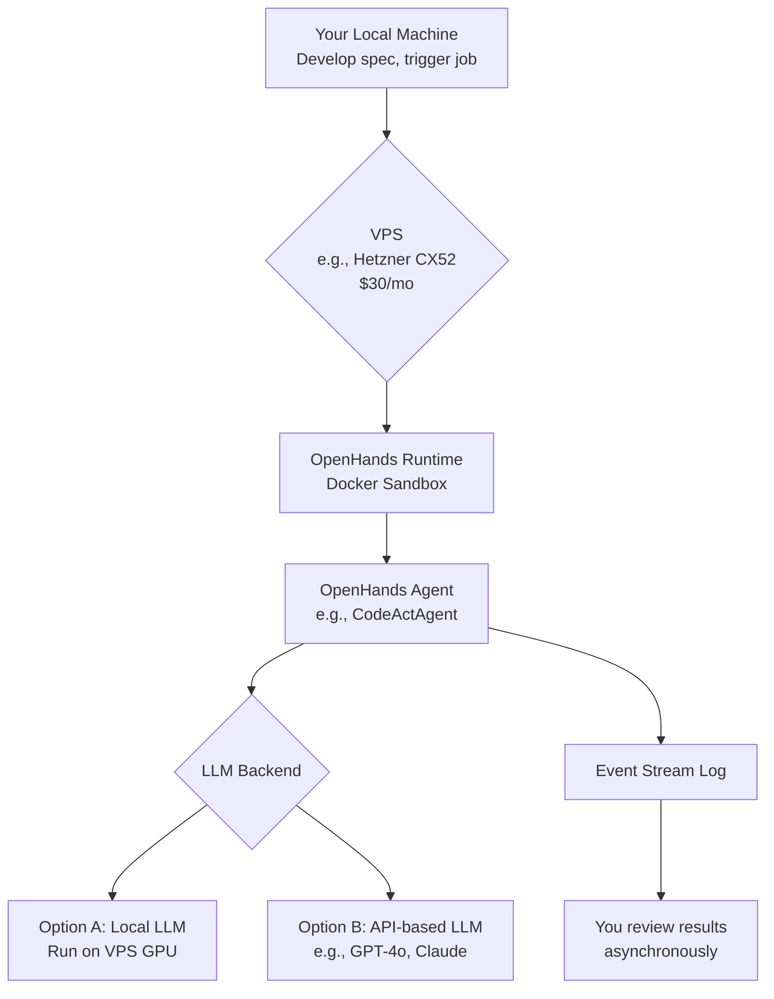

Excellent question. You've articulated a common and critical pain point for advanced users of AI coding agents. Your goal to shift from a "watch-and-guide" to a "plan-and-review" workflow is precisely where the value of these tools becomes transformative.

Based on a thorough analysis of the provided materials and the current state of agentic frameworks, this report provides a detailed technical roadmap to achieve that shift using OpenHands and complementary technologies, all within your specified budget.

### **Executive Summary: The Path to Autonomous Execution**

Your current workflow with Copilot and Cursor is interactive and synchronous. To achieve overnight, unsupervised execution, you need an **asynchronous, agentic system**. OpenHands is the ideal platform for this. It is not just another coding assistant; it is an **autonomous agent platform** designed to perform complex, multi-step engineering tasks with minimal human intervention.

The core shift involves moving from:
*   **Manual Triggering:** You typing a prompt and watching.
*   **To:** **Workload Delegation:** You defining a task specification, initiating a headless or background job, and returning later for review.

This report will detail how to achieve this by leveraging OpenHands' architecture for planning, delegation, and resilient execution.

### **1. Analysis of OpenHands' Core Components for Autonomous Workflow**

The provided documents highlight the specific technical features of OpenHands that are most valuable for your desired workflow.

| Core Component | Why It's Critical for Your Goal | Key Capabilities from the Analysis |
| :--- | :--- | :--- |
| **Event Stream Architecture** | Provides a complete, auditable log of every action and observation. This is the foundation for **asynchronous review**. You don't need to watch live; you can inspect the stream later. | A chronological collection of past actions and observations, including agent actions and user feedback. (Source: ICLR Paper, p. 3) |
| **Sandboxed Runtime Environment** | Enables safe, long-running, and reproducible execution. The agent can install packages, run servers, and browse the web in isolation without risking your host system or requiring your intervention. | Docker-sandboxed OS with bash, an IPython server, and a web browser. Supports arbitrary Docker images for customized environments. (Source: ICLR Paper, pp. 2, 4-5) |
| **Multi-Agent Delegation & Specialization** | Allows for complex workflows to be broken down. A "planner" agent could interpret your high-level spec and delegate specific coding tasks to a "coder" agent and testing to a "debugger" agent, improving reliability. | Allows multiple specialized agents to work together. The agent hub includes a strong generalist agent (CodeAct) and specialists. (Source: ICLR Paper, pp. 2-3) |
| **Extensible Agent-Computer Interface (Skills)** | The agent's ability to use tools (bash, browser, file editor) is what makes it autonomous. It can fix its own environment, search for solutions online, and run its own tests. | Enables agents to create and edit complex software, execute arbitrary code, and browse websites to collect information. (Source: ICLR Paper, p. 2) |
| **Multiple Interfaces (CLI, SDK)** | Crucial for your "deploy and forget" model. The **CLI** and **SDK** allow you to start a session programmatically from a script, rather than through the GUI, enabling overnight execution on a remote server. | Offers CLI and Software Agent SDK for programmatic use, in addition to the local GUI. (Source: DeepWiki, Product Variants) |

### **2. Recommended Architecture & Budget Breakdown**

Your budget of ~$60/month is more than sufficient to build a powerful autonomous agent system. The core cost driver is the LLM. The provided analysis shows that high-quality open-weight models are now within 2.2%–6.4% of proprietary models on benchmarks like SWE-Bench, making local execution a viable and cost-effective option.

**Proposed Architecture: Hybrid VPS + Local LLM (or API)**

This architecture balances autonomy, cost, and performance.

**Budget Allocation:**
*   **Virtual Private Server (VPS): ~$30/month**
    *   **Recommendation:** A dedicated server or powerful cloud VPS is non-negotiable for overnight runs. Your laptop cannot be expected to run for hours uninterrupted.
    *   **Specs:** Look for providers like Hetzner (CX52, ~$16-30/mo) or Vultr/ Linode with focus on **high CPU performance and RAM (16GB+)** . If you want to run a decent local model (e.g., 30B parameters), you will need a VPS with a GPU, which costs more ($40-80+). For your budget, an **API-based LLM** is currently the most pragmatic choice for reliable, high-quality results.
*   **LLM API Costs: ~$20-30/month**
    *   **Strategy:** Use this for the heavy lifting of agentic reasoning. This is where the performance difference is most noticeable for complex tasks. With careful prompt engineering (using your `agents.md` and `openspec`), you can keep token usage efficient. A single overnight task might cost $2-5.
*   **Open-Source Tooling: $0**
    *   OpenHands, Docker, and related tools are free and open-source, fitting perfectly within your budget.

### **3. Implementation Strategy for Overnight Execution**

Transitioning from GUI monitoring to CLI-driven delegation requires a specific setup.

1.  **Provision Your VPS:**
    *   Rent a VPS with Ubuntu 22.04 or 24.04.
    *   Install Docker and Docker Compose.
    *   Ensure you have `make` and `git` installed.

2.  **Deploy OpenHands in Headless Mode:**
    *   Clone the OpenHands repository on your VPS.
    *   Use the command-line interface (CLI) or the Software Agent SDK to start a session programmatically. You will **not** start the frontend GUI.
    *   **Configuration:** Set up your environment variables for the LLM provider (e.g., `OPENAI_API_KEY`). The DeepWiki confirms OpenHands uses `litellm`, making it compatible with virtually any provider.

3.  **Define the "Handoff" Mechanism (Your Prompt):**
    *   This is the most critical step. Your prompt must be a self-contained **project specification**, not a conversational opener.
    *   **Template:**
        > **Objective:** Implement feature X as defined in `docs/feature-spec.md`.
        > **Context:** The project is in the `/workspace/myapp` directory. The current architecture is documented in `agents.md`.
        > **Constraints:** Use the existing `requests` library for API calls. Do not introduce new external dependencies without strong justification.
        > **Definition of Done:**
        > 1.  Code written in `app/new_feature.py`.
        > 2.  Unit tests added in `tests/test_new_feature.py` that pass.
        > 3.  The existing integration tests all pass (`pytest tests/integration`).
        > 4.  Provide a final summary report in `output.md`.

4.  **Execute and Detach:**
    *   Use `tmux` or `screen` on your VPS to start the OpenHands CLI command, then detach. This ensures the process continues even if your SSH connection drops.
    *   **Example (Conceptual):** `tmux new -s overnight_task` then `openhands cli --task "Implement feature X from spec..." --workspace /path/to/repo` then `Ctrl+b, d` to detach.

5.  **Review Asynchronously:**
    *   The next day, reattach to the tmux session (`tmux attach -t overnight_task`) to see the final output.
    *   OpenHands' **Event Stream** will have logged every action, command, and observation. You can review this history to understand exactly what the agent did, without having watched it live.

### **4. Improving Reliability & Reducing Interventions**

To minimize failures, you must engineer the agent's environment and constraints as carefully as you engineer the code.

*   **Leverage `openspec` and `agents.md` for Agent Context:** Provide these documents **as part of the initial prompt or as files in the workspace**. The agent can read them to understand coding standards, architectural patterns, and testing requirements. This grounds the agent in your project's specific best practices.
*   **Use a "Plan and Delegate" Agent Pattern:** Instead of a single agent doing everything, configure a workflow where a **Planner Agent** (using a powerful, high-cost LLM) first reads your spec and `agents.md` to create a step-by-step plan. It then delegates each step (e.g., "write function X", "write test for function X") to **Worker Agents** (using a faster, cheaper model). This compartmentalizes complexity and makes failures easier to pinpoint and correct in the next iteration.
*   **Implement Checkpoints:** The OpenHands runtime environment is Docker-based. You can script the process to create a Docker image snapshot of the workspace after major milestones (e.g., "after successful setup," "before risky refactor"). If a later step fails, you can restart the agent from the last known good state.
*   **Constrained Action Space:** In your initial prompt, you can instruct the agent to favor certain tools. For example, "Use the `bash` tool for running tests, and the `python` tool for file edits." This can sometimes lead to more predictable behavior than letting it freely choose.
*   **SWE-Bench as a Guide:** The ICLR paper highlights OpenHands' strong performance on SWE-Bench, a benchmark for real-world software issues. This demonstrates the platform's capability. Use the successful strategies from the OpenHands agent implementations as inspiration for your own prompting (e.g., encouraging the agent to search for error messages online, write reproduction scripts, etc.).

### **Conclusion**

Your goal is entirely achievable. By deploying OpenHands on a VPS, shifting to CLI-based interaction, and meticulously crafting your task specifications as comprehensive project briefs, you can transform your workflow. You move from being a **supervisor** of an AI intern to a **manager** who delegates projects and reviews deliverables.

The initial investment of time will be in setting up the VPS environment and refining your "handoff" prompts. The payoff, however, is the ability to reclaim your focus for higher-level engineering and strategy, confident that a capable, autonomous agent is making progress on the tasks you've defined.

To get started immediately, I recommend you provision a low-cost VPS, follow the OpenHands installation guide, and attempt a small, well-defined task using the CLI on a simple public GitHub repository. This will validate the workflow before you scale it to your core projects.

---

## Official / 2026 links

- [Headless mode](https://docs.openhands.dev/openhands/usage/run-openhands/headless-mode) — `always-approve`, `--json` JSONL
- [CLI command reference](https://docs.openhands.dev/openhands/usage/cli/command-reference) — `agent_settings.json`, `--host`, `--override-with-envs`
- [SDK index](https://docs.openhands.dev/sdk/index) · [Agent Server overview](https://docs.openhands.dev/sdk/guides/agent-server/overview)
- [Docker sandbox](https://docs.openhands.dev/sdk/guides/agent-server/docker-sandbox) · [SDK security / confirmation](https://docs.openhands.dev/sdk/guides/security)
- [GitHub `All-Hands-AI/OpenHands`](https://github.com/All-Hands-AI/OpenHands) · [`OpenHands/software-agent-sdk`](https://github.com/OpenHands/software-agent-sdk)
- Production hardening notes: [`research_overnight_stack_web/gap_wave2/findings_gap_openhands_production.md`](research_overnight_stack_web/gap_wave2/findings_gap_openhands_production.md)
